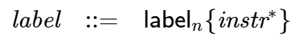
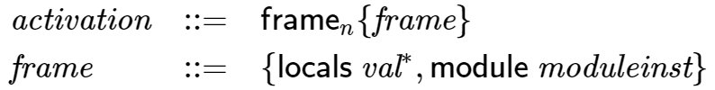
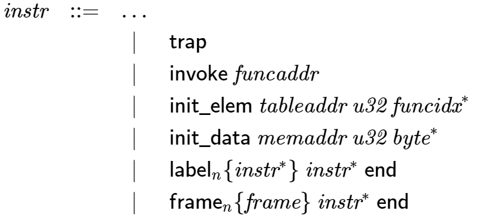
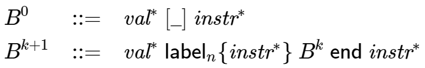
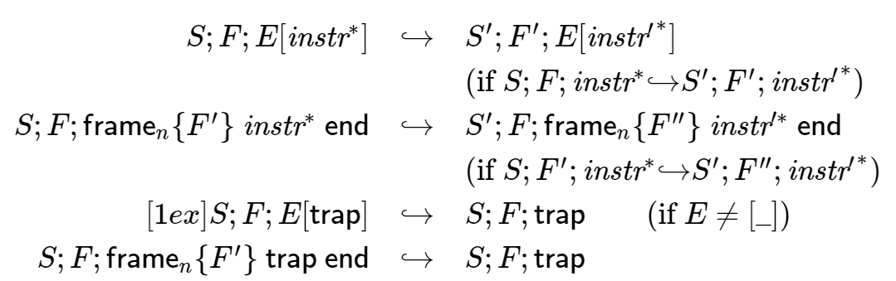

# 表記上のお約束

`WebAssembly`のコードは、モジュールをインスタンス化する時、または結果として得られたモジュールのインスタンス上でExportされた関数を呼び出すときに実行されます。

実行時の挙動は、プログラムの状態をモデル化する抽象マシンの観点から定義されます。
これには、オペランド値と制御構造を記録するスタックと、グローバル状態を含む抽象ストアが含まれます。

各命令に対して、その実行がプログラムの状態に与える影響を指定する規則があります。
さらに、モジュールのインスタンス化を記述する規則もあります。
[検証](Validation)と同様に、すべての規則は2つの等価な形式で与えられます。

- 散文的表記法では、人間にわかりやすい直感的な形で意味を記述します。
- 形式的表記法では、数学的な形式で規則を記述します。

## 散文的表記法

実行は抽象構文の各命令について様式化された段階的な規則によって指定されます。
これらの規則を記述する際には、以下の規則が採用されています。

- 実行規則は暗黙のうちに与えられたストア`S`を想定しています。
- 実行規則はまた、値、ラベル、フレームをpushまたはpopすることで変更される暗黙のスタックの存在も想定しています。
- 特定の規則では、スタックが少なくとも1つのフレームを含むことを要求します。最新のフレームはカレントフレームと呼ばれます。
- ストアとカレントフレームの両方は、それらのコンポーネントの一部を置き換えることで変更されます。このような置換はグローバルに適用されると仮定されます。
- 命令の実行がトラップされることがあります。この場合計算全体が中断され、それ以上のストアへの変更は行われません（他の計算はまだ開始できます）。(その後も他の計算を開始することができます。)
- 命令の実行は、次の命令を定義する指定されたターゲットへのジャンプで終了することもできます。
- 実行は、ブロックを形成する命令シーケンスに入ったり出たりすることができます。
- 命令シーケンスは、トラップやジャンプが発生しない限り、暗黙のうちに順番に実行されます。
- 規則の様々な場所で、プログラムの状態に関する重要な不変量を表現するアサーションが含まれています。

## 形式的表記法

正式な実行規則は運用セマンティクスを指定するための標準的なアプローチを使用してそれらを還元規則に還元します。
すべての規則は以下の一般的な形式を持っています。

\[\mathit{configuration} \quad{\hookrightarrow}\quad \mathit{configuration}\]

設定とはプログラムの状態を構文的に記述したものです。
各規則は実行の1つのステップを指定します。
与えられた設定に適用可能な還元規則が高々1つある限り、還元とそれに連なる実行は決定論的です。
`WebAssembly`には、これに対する例外がごくわずかしかありません。
それら例外はこの仕様で明示されています。

`WebAssembly`において、設定とは通常:

- 現在のストア`S`
- 現在の関数の呼び出しフレーム`F`
- 実行される命令のシーケンス

を構成要素とするタプル\((S; F; {\mathit{instr}}^\ast)\)です。

不要な複雑生を避けるために、ストア`S`とフレーム`F`は、それらと関係ない還元規則では表記を省略されています。

スタックの個別の表現はありません。
その代わりに、構成の命令列の一部として便利に表現されています。
特に値は`const`命令と一致するように定義されており、`const`命令のシーケンスは、右に成長するオペランド「スタック」と解釈することができます。

ラベルとフレームは、似たようなものですので命令シーケンスの一部として定義されます。

還元の順序は、適切な評価コンテキストの定義によって決定されます。

還元はこれ以上の還元規則が適用できなくなると終了します。
`WebAssembly`型システムの健全性は元の命令シーケンスが、結果として得られるオペランドスタックの値として解釈できるconst命令のシーケンスに還元された場合、またはトラップが発生した場合にのみ、上記事実を保証しています。

### 付記

例として以下の命令シーケンスを考えることとします。

\[({\mathsf{f64}}.{\mathsf{const}}~x_1)~({\mathsf{f64}}.{\mathsf{const}}~x_2)~{\mathsf{f64}}.{\mathsf{neg}}~({\mathsf{f64}}.{\mathsf{const}}~x_3)~{\mathsf{f64}}.{\mathsf{add}}~{\mathsf{f64}}.{\mathsf{mul}}\]

これは3ステップの還元を経て最終形に落ち着きます。

\[\begin{split}\begin{array}{ll}
& ({\mathsf{f64}}.{\mathsf{const}}~x_1)~({\mathsf{f64}}.{\mathsf{const}}~x_2)~{\mathsf{f64}}.{\mathsf{neg}}~({\mathsf{f64}}.{\mathsf{const}}~x_3)~{\mathsf{f64}}.{\mathsf{add}}~{\mathsf{f64}}.{\mathsf{mul}} \\
{\hookrightarrow} & ({\mathsf{f64}}.{\mathsf{const}}~x_1)~({\mathsf{f64}}.{\mathsf{const}}~x_4)~({\mathsf{f64}}.{\mathsf{const}}~x_3)~{\mathsf{f64}}.{\mathsf{add}}~{\mathsf{f64}}.{\mathsf{mul}} \\
{\hookrightarrow} & ({\mathsf{f64}}.{\mathsf{const}}~x_1)~({\mathsf{f64}}.{\mathsf{const}}~x_5)~{\mathsf{f64}}.{\mathsf{mul}} \\
{\hookrightarrow} & ({\mathsf{f64}}.{\mathsf{const}}~x_6) \\
\end{array}\end{split}\]

<ul>
    <li>\(x_4 = -x_2\)</li>
    <li>\(x_5 = -x_2 + x_3\)</li>
    <li>\(x_6 = x_1 \cdot (-x_2 + x_3)\)</li>
</ul>

# ランタイムの構造

ストア、スタック、および値やモジュールインスタンスなどの`WebAssembly`抽象マシンを形成する他のランタイム構造は、追加の補助構文の観点から正確に作られています。

## 値

`WebAssembly`の計算は、4つの基本的な値の型を対照にしています。
それぞれ32ビット幅または64ビット幅の整数と浮動小数点データの値を操作します。

セマンティクスのほとんどの場所で、異なる型の値が発生する可能性があります。
曖昧さを避けるために、値はその型を明示的にする抽象構文で表現されます。
値を生成するconst命令と同じ表記法を再利用すると便利です．

\[\begin{split}\begin{array}{llcl}
{\mathit{val}} &::=&
  {\mathsf{i32}}.{\mathsf{const}}~{\mathit{i32}} \\&&|&
  {\mathsf{i64}}.{\mathsf{const}}~{\mathit{i64}} \\&&|&
  {\mathsf{f32}}.{\mathsf{const}}~{\mathit{f32}} \\&&|&
  {\mathsf{f64}}.{\mathsf{const}}~{\mathit{f64}}
\end{array}\end{split}\]

## 戻り値

戻り値は計算結果です。
複数乃至1つの値かトラップのどちらかです。

\[\begin{split}\begin{array}{llcl}
{\mathit{result}} &::=&
  {\mathit{val}}^\ast \\&&|&
  {\mathsf{trap}}
\end{array}\end{split}\]

## ストア

ストアは`WebAssembly`プログラムによって操作可能なすべてのグローバル状態を表します。
これは、抽象マシンのライフタイム中に割り当てられた関数、テーブル、メモリ、およびグローバルのすべてのインスタンスのランタイム表現で構成されています。

説明上では、ストアは各カテゴリの既存のインスタンスを列挙したレコードとして定義されます。

\[\begin{split}\begin{array}{llll}
{\mathit{store}} &::=& \{~
  \begin{array}[t]{l@{~}ll}
  {\mathsf{funcs}} & {\mathit{funcinst}}^\ast, \\
  {\mathsf{tables}} & {\mathit{tableinst}}^\ast, \\
  {\mathsf{mems}} & {\mathit{meminst}}^\ast, \\
  {\mathsf{globals}} & {\mathit{globalinst}}^\ast ~\} \\
  \end{array}
\end{array}\end{split}\]

実際にはストアから参照されなくなったオブジェクトを削除するために、ガベージコレクションのような技術を実装することができます。
しかしそのような技術は意味論的に観察できないためこの仕様の範囲外となります。

### 表記上のお約束

メタ変数`S`はコンテキストから明らかな場合にはストアの範囲になります。

## アドレス

ストア内の関数インスタンス、テーブルインスタンス、メモリインスタンス、およびグローバルインスタンスは、抽象アドレスで参照されます。
これらは、それぞれのストアコンポーネントへの単純なインデックスです。

\[\begin{split}\begin{array}{llll}
{\mathit{addr}} &::=&
  0 ~|~ 1 ~|~ 2 ~|~ \dots \\
{\mathit{funcaddr}} &::=&
  {\mathit{addr}} \\
{\mathit{tableaddr}} &::=&
  {\mathit{addr}} \\
{\mathit{memaddr}} &::=&
  {\mathit{addr}} \\
{\mathit{globaladdr}} &::=&
  {\mathit{addr}} \\
\end{array}\end{split}\]

エンベッダーは、そのアドレスに対応するExportされたストア オブジェクトに ID を割り当てることができます。
このIDが`WebAssembly`コード自体からは観測できない場合（関数インスタンスや不変グローバルなど）であっても、そのアドレスに対応するストア オブジェクトにIDを割り当てることができます。

### 付記

アドレスは、ランタイム・オブジェクトへの動的でグローバルに一意な参照であるのに対し、インデックスは元の定義への静的でモジュールローカルな参照です。
メモリアドレス`memaddr`は、ストア内のメモリインスタンスの抽象アドレスを示し、メモリインスタンス内のオフセットではありません。

ストアオブジェクトの割り当て数には特に制限がないため、論理アドレスは任意の大きな自然数になります。

## モジュールインスタンス

モジュールインスタンスは、モジュールのランタイム表現です。
モジュールのインスタンスを作成することで作成され、モジュールによってImport、定義、またはExportされたすべてのエンティティのランタイム表現を収集します。

\[\begin{split}\begin{array}{llll}
{\mathit{moduleinst}} &::=& \{
  \begin{array}[t]{l@{~}ll}
  {\mathsf{types}} & {\mathit{functype}}^\ast, \\
  {\mathsf{funcaddrs}} & {\mathit{funcaddr}}^\ast, \\
  {\mathsf{tableaddrs}} & {\mathit{tableaddr}}^\ast, \\
  {\mathsf{memaddrs}} & {\mathit{memaddr}}^\ast, \\
  {\mathsf{globaladdrs}} & {\mathit{globaladdr}}^\ast, \\
  {\mathsf{exports}} & {\mathit{exportinst}}^\ast ~\} \\
  \end{array}
\end{array}\end{split}\]

各コンポーネントは、Importされているか定義されているかに関わらず、元のモジュールからのそれぞれの宣言に対応するランタイムインスタンスを静的インデックスの順に参照します。
関数インスタンス、テーブルインスタンス、メモリインスタンス、グローバルインスタンスは、ストア内のそれぞれのアドレスを介して間接的に参照されます。

与えられたモジュールインスタンス内のすべてのExportインスタンスが異なる名前を持つことは、恒常的な前提条件です。

## 関数インスタンス

関数インスタンスは、関数のランタイム表現です。
これは、元のモジュールのランタイムモジュールインスタンスの上にある元の関数のクロージャです。
モジュールインスタンスは、関数の実行中に他の定義への参照を解決するために使用されます。

\[\begin{split}\begin{array}{llll}
{\mathit{funcinst}} &::=&
  \{ {\mathsf{type}}~{\mathit{functype}}, {\mathsf{module}}~{\mathit{moduleinst}}, {\mathsf{code}}~{\mathit{func}} \} \\ &&|&
  \{ {\mathsf{type}}~{\mathit{functype}}, {\mathsf{hostcode}}~{\mathit{hostfunc}} \} \\
{\mathit{hostfunc}} &::=& \dots \\
\end{array}\end{split}\]

ホスト関数とは、`WebAssembly`の外部で定義されますが、インポートとしてモジュールに渡される関数のことです。
ホスト関数の定義と動作は、本仕様の範囲外です。
この仕様の目的のために、ホスト関数が呼び出されたとき、ランタイムの整合性を保証する特定の制約の範囲内で、非決定論的に振る舞うことを前提としています。

## 付記

関数インスタンスは不変であり、その同一性は WebAssembly コードでは観測できません。
しかし、エンベッダーは、それらのアドレスを区別するための暗黙的または明示的な手段を提供するかもしれません。

## テーブルインスタンス

テーブルインスタンスは、テーブルのランタイム表現です。
これは関数要素のベクトルとオプションで最大サイズを保持します（テーブルの定義サイトでテーブルタイプで指定された場合）。

各関数要素は、初期化されていないテーブル項目を表す空か、関数アドレスのいずれかです。
関数要素は、要素セグメントの実行によって、あるいはエンベッダーによって提供される外部の手段によって、変更することができます。

\[\begin{split}\begin{array}{llll}
{\mathit{tableinst}} &::=&
  \{ {\mathsf{elem}}~{\mathit{vec}}({\mathit{funcelem}}), {\mathsf{max}}~{\mathit{u32}}^? \} \\
{\mathit{funcelem}} &::=&
  {\mathit{funcaddr}}^? \\
\end{array}\end{split}\]

これは，要素ベクトルの長さが最大サイズを超えることがないというセマンティクスの不変性です（存在する場合）。

### 付記

`WebAssembly`の将来のバージョンでは、その他のテーブル要素型が追加されるかもしれません。

## メモリインスタンス

メモリインスタンスは、リニアメモリのランタイム表現です。
メモリの定義場所で最大サイズが指定されている場合は、オプションで最大バイト数のバイト列を保持します。

\[\begin{split}\begin{array}{llll}
{\mathit{meminst}} &::=&
  \{ {\mathsf{data}}~{\mathit{vec}}({\mathit{byte}}), {\mathsf{max}}~{\mathit{u32}}^? \} \\
\end{array}\end{split}\]

バイト列の長さは常にWebAssemblyのページサイズの倍数(定数65536)です。
メモリ型の場合と同様に、メモリインスタンス内の最大サイズはこのページサイズの単位で与えられます。

バイトは、メモリ命令、データセグメントの実行、またはエンベッダーによって提供される外部手段によって変更可能です。

ページサイズで割ったバイト列の長さが最大サイズを超えることはありません。

## グローバルインスタンス

グローバルインスタンスは、グローバル変数のランタイム表現です。
個々の値と、それが変更可能かどうかを示すフラグを保持します。

\[\begin{split}\begin{array}{llll}
{\mathit{globalinst}} &::=&
  \{ {\mathsf{value}}~{\mathit{val}}, {\mathsf{mut}}~{\mathit{mut}} \} \\
\end{array}\end{split}\]

変更可能なグローバルの値は、変数命令またはエンベッダーが提供する外部手段によって変更できます。

## Exportインスタンス

Exportインスタンスは、Exportのランタイム表現です。
Exportの名前と関連する外部値を定義します。

\[\begin{split}\begin{array}{llll}
{\mathit{exportinst}} &::=&
  \{ {\mathsf{name}}~{\mathit{name}}, {\mathsf{value}}~{\mathit{externval}} \} \\
\end{array}\end{split}\]

## 外部値

外部値は、インポートまたはエクスポート可能なエンティティのランタイム表現です。
外部値は、共有ストア内の関数インスタンス、テーブルインスタンス、メモリインスタンス、グローバルインスタンスのいずれかを表すアドレスです。

\[\begin{split}\begin{array}{llcl}
{\mathit{externval}} &::=& {\mathsf{func}}~{\mathit{funcaddr}} \\
&&|& {\mathsf{table}}~{\mathit{tableaddr}} \\
&&|& {\mathsf{mem}}~{\mathit{memaddr}} \\
&&|& {\mathsf{global}}~{\mathit{globaladdr}} \\
\end{array}\end{split}\]

### 表記上のお約束

以下の補助記法は、外部値のシーケンスに対して定義されています。
これは、特定の種類のエントリを順序を保持してフィルタリングします。

<ul>
    <li>\({\mathrm{funcs}}({\mathit{externval}}^\ast) = [{\mathit{funcaddr}} ~|~ ({\mathsf{func}}~{\mathit{funcaddr}}) \in {\mathit{externval}}^\ast]\)</li>
    <li>\({\mathrm{tables}}({\mathit{externval}}^\ast) = [{\mathit{tableaddr}} ~|~ ({\mathsf{table}}~{\mathit{tableaddr}}) \in {\mathit{externval}}^\ast]\)</li>
    <li>\({\mathrm{mems}}({\mathit{externval}}^\ast) = [{\mathit{memaddr}} ~|~ ({\mathsf{mem}}~{\mathit{memaddr}}) \in {\mathit{externval}}^\ast]\)</li>
    <li>\({\mathrm{globals}}({\mathit{externval}}^\ast) = [{\mathit{globaladdr}} ~|~ ({\mathsf{global}}~{\mathit{globaladdr}}) \in {\mathit{externval}}^\ast]\)</li>
</ul>

## スタック

ストアの他にほとんどの命令は暗黙のスタックと対話します。
スタックには3種類のエントリが含まれています。

- 値: 命令のオペランド。
- ラベル: 分岐によって対象となるアクティブな構造化制御命令。
- アクティベーション: アクティブな関数呼び出しの呼び出しフレーム。

これらのエントリは、プログラムの実行中にスタック上で任意の順序で発生する可能性があります。
スタックエントリは、以下のように抽象構文で記述されます。

### 付記

オペランド、制御構造、および呼び出しのために別々のスタックを使用して`WebAssembly`のセマンティクスをモデル化することが可能です。
しかし、スタックは相互に依存しているので関連するスタックの高さについての追加のブックキーピングが必要になります。
この仕様の目的のためには、インターリーブされた表現の方がシンプルです。

### スタック上の値

そのまま表記されます。

### スタック上のラベル

ラベルは、引数のアリティ`n`とそれに関連する分岐ターゲットを持ち、構文的には命令シーケンスとして表現されます。

直感的には、\({\mathit{instr}}^\ast\)は、元の制御構造体の代わりに、ブランチを取ったときに実行する継続部分です。

#### 付記

例えば、ループラベルは次のような形をしています。

\[{\mathsf{label}}_n\{{\mathsf{loop}}~\dots~{\mathsf{end}}\}\]

このラベルへの分岐を実行すると、ループが実行され、効果的に最初から再開されます。逆に、
単純なブロックラベルは次のような形式になります。

\[{\mathsf{label}}_n\{\epsilon\}\]

分岐する場合、空の継続は対象ブロックを終了させ、連続した命令で実行を進めることができます。

### アクティベーションフレーム

アクティベーションフレームは、各関数の戻り値のアリティ`n`を持ち、そのロケール（引数を含む）の値を静的なローカルインデックスに対応する順番で保持し、関数自身のモジュールインスタンスへの参照を保持します。

ローカルの値は、それぞれの変数命令によって変更されます。

### 表記上のお約束

<ul>
    <li>メタ変数<b>L</b>は、文脈から明らかなように、ラベルの範囲内にあります。</li>
    <li>メタ変数<b>F</b>は、コンテキストから明らかなフレームの範囲内にあります。</li>
    <li>以下の補助定義は、ブロック型を取り、現在のフレームでそれが示す関数型を検索します。
        
\[\begin{split}\begin{array}{lll}
{\mathrm{expand}}_F({\mathit{typeidx}}) &=& F.{\mathsf{module}}.{\mathsf{types}}[{\mathit{typeidx}}] \\
{\mathrm{expand}}_F([{\mathit{valtype}}^?]) &=& [] {\rightarrow} [{\mathit{valtype}}^?] \\
\end{array}\end{split}\]

    </li>
</ul>

## 管理命令

本節は形式的記法にのみ関連します。

トラップ、呼び出し、制御命令の還元を表現するために、命令の構文を拡張して以下のような管理命令が含まれるようにしました。

`trap`命令は、トラップの発生を表します。
トラップは、入れ子になった命令シーケンスを通してバブルアップされ、最終的にはプログラム全体を単一のトラップ命令に減らし、突然の終了を示します。

`invoke`命令は、アドレスで識別される関数インスタンスの差し迫った呼び出しを表します。これにより、さまざまな形式の呼び出しの処理が統一されます。

`init_elem`命令と`init_data`命令は、モジュールのインスタンス化中に要素とデータセグメントの初期化を行います。

#### 付記

インスタンス化を個々の還元ステップに分割する理由は、スレッドのような将来の拡張と互換性のあるセマンティクスを提供するためです。

---

ラベル命令とフレーム命令は、ラベルとフレームを「スタック上」でモデル化します。
さらに、管理構文は、元の構造化制御命令または関数本体とそれらの命令シーケンスの入れ子構造をエンドマーカーで維持します。
そのようにして、内側の命令シーケンスの終わりは、外側のシーケンスの一部であるときに知られています。

#### 付記

例えば、ブロックの還元規則は以下のようになります。

\[{\mathsf{label}}_0\{{\mathit{instr}}^\ast\}~{B}^l[{\mathsf{br}}~l]~{\mathsf{end}} \quad{\hookrightarrow}\quad {\mathit{instr}}^\ast\]

これはブロックをラベル命令に置き換えますが、これはスタック上のラベルを「押す」と解釈できます。
`end`に到達したとき、つまり内部の命令列が空の列に還元されたとき、つまり結果として得られる値を表すn個の`const`命令の列に還元されたとき、ラベル命令はそれ自身の還元ルールによって除去されます。

\[{\mathsf{label}}_m\{{\mathit{instr}}^\ast\}~{\mathit{val}}^n~{\mathsf{end}} \quad{\hookrightarrow}\quad {\mathit{val}}^n\]

これは、スタックからラベルを取り除き、ローカルに蓄積されたオペランドの値だけを残すと解釈できます。

### ブロックコンテキスト

分岐の還元を指定するために、次の計算を行う場所を示す穴[_]を囲むラベルの数kをインデックスとしたブロックコンテキストの構文を以下のように定義しています。

この定義でにより、分岐命令や戻り命令の周囲にあるアクティブなラベルをインデックス化することができます。

#### 付記

例えば、単純な分岐の還元は次のように定義できます。

\[{\mathsf{label}}_0\{{\mathit{instr}}^\ast\}~{B}^l[{\mathsf{br}}~l]~{\mathsf{end}} \quad{\hookrightarrow}\quad {\mathit{instr}}^\ast\]

ここでは、コンテキストの穴[_]が分岐命令でインスタンス化されます。
分岐が発生すると、この規則は対象となるラベルと関連する命令シーケンスをラベルの続きに置き換えます。
選択されたラベルはラベルインデックス`l`で識別されます。
これは、ホップオーバーされなければならない周囲のラベル命令の数に対応します。

### 設定

コンフィギュレーションは、現在のストアと実行中のスレッドから構成されます。

スレッドとは、計算が実行されているモジュールインスタンスを参照するカレントフレーム(現在の関数がどこから来ているかを示す)に対して相対的に動作する命令の上での計算のことです。

\[\begin{split}\begin{array}{llcl}
{\mathit{config}} &::=& {\mathit{store}}; {\mathit{thread}} \\
{\mathit{thread}} &::=& {\mathit{frame}}; {\mathit{instr}}^\ast \\
\end{array}\end{split}\]

#### 付記

現在のバージョンの`WebAssembly`はシングルスレッドですが、将来的には複数のスレッドを使用した構成もサポートされるかもしれません。

### 評価コンテキスト

最後に、以下の評価コンテキストの定義とそれに関連した構造規則により、命令シーケンスや管理形式の中での還元やトラップの伝播が可能になります。

スレッドの命令シーケンスが結果、つまり値のシーケンスかトラップのいずれかに還元された場合、還元は終了します。

# 数値

### 表記上のお約束

## 表現

### 整数

### 浮動小数点数

### ストレージ

## 整数演算

### 符号化

### 真偽値化

## 浮動小数点数演算

### 丸め

### NaN伝播

## 変換

# 命令

## 算術演算命令

## パラメトリック命令

## 変数命令

## メモリ命令

## 制御命令

## ブロック

## 関数呼び出し

## 式

# モジュール

## 外部型

## Importマッチング

## アロケーション

## インスタンス化

## 起動

# LINK

<footer>
    <nav>
        <ul>
            <li><a href="Validation" rel="prev">Prev: 検証</a></li>
            <li><a href="./">Top: Index</a></li>
            <li><a href="BinaryFormat" rel="next">Next: Binary Format</a></li>
        </ul>
        <a href="LICENSE" rel="license">LICENSE</a>
    </nav>
</footer>