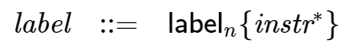
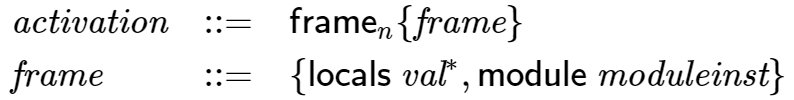
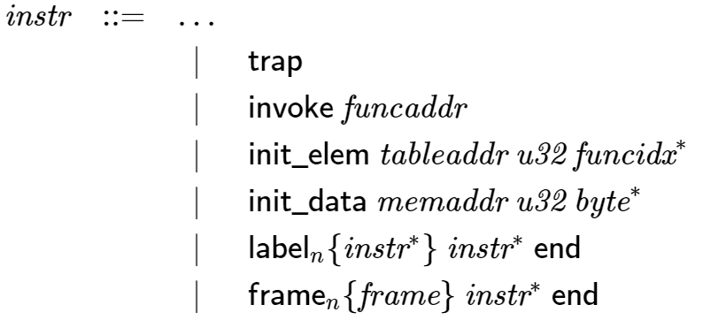
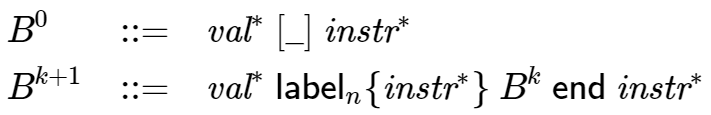

# 表記上のお約束

`WebAssembly`のコードは、モジュールをインスタンス化する時、または結果として得られたモジュールのインスタンス上でExportされた関数を呼び出すときに実行されます。

実行時の挙動は、プログラムの状態をモデル化する抽象マシンの観点から定義されます。
これには、オペランド値と制御構造を記録するスタックと、グローバル状態を含む抽象ストアが含まれます。

各命令に対して、その実行がプログラムの状態に与える影響を指定する規則があります。
さらに、モジュールのインスタンス化を記述する規則もあります。
[検証](Validation)と同様に、すべての規則は2つの等価な形式で与えられます。

- 散文的表記法では、人間にわかりやすい直感的な形で意味を記述します。
- 形式的表記法では、数学的な形式で規則を記述します。

## 散文的表記法

実行は抽象構文の各命令について様式化された段階的な規則によって指定されます。
これらの規則を記述する際には、以下の規則が採用されています。

- 実行規則は暗黙のうちに与えられたストア`S`を想定しています。
- 実行規則はまた、値、ラベル、フレームをpushまたはpopすることで変更される暗黙のスタックの存在も想定しています。
- 特定の規則では、スタックが少なくとも1つのフレームを含むことを要求します。最新のフレームはカレントフレームと呼ばれます。
- ストアとカレントフレームの両方は、それらのコンポーネントの一部を置き換えることで変更されます。このような置換はグローバルに適用されると仮定されます。
- 命令の実行がトラップされることがあります。この場合計算全体が中断され、それ以上のストアへの変更は行われません（他の計算はまだ開始できます）。(その後も他の計算を開始することができます。)
- 命令の実行は、次の命令を定義する指定されたターゲットへのジャンプで終了することもできます。
- 実行は、ブロックを形成する命令シーケンスに入ったり出たりすることができます。
- 命令シーケンスは、トラップやジャンプが発生しない限り、暗黙のうちに順番に実行されます。
- 規則の様々な場所で、プログラムの状態に関する重要な不変量を表現するアサーションが含まれています。

## 形式的表記法

正式な実行規則は運用セマンティクスを指定するための標準的なアプローチを使用してそれらを還元規則に還元します。
すべての規則は以下の一般的な形式を持っています。

\[\mathit{configuration} \quad{\hookrightarrow}\quad \mathit{configuration}\]

設定とはプログラムの状態を構文的に記述したものです。
各規則は実行の1つのステップを指定します。
与えられた設定に適用可能な還元規則が高々1つある限り、還元とそれに連なる実行は決定論的です。
`WebAssembly`には、これに対する例外がごくわずかしかありません。
それら例外はこの仕様で明示されています。

`WebAssembly`において、設定とは通常:

- 現在のストア`S`
- 現在の関数の呼び出しフレーム`F`
- 実行される命令のシーケンス

を構成要素とするタプル\((S; F; {\mathit{instr}}^\ast)\)です。

不要な複雑生を避けるために、ストア`S`とフレーム`F`は、それらと関係ない還元規則では表記を省略されています。

スタックの個別の表現はありません。
その代わりに、構成の命令列の一部として便利に表現されています。
特に値は`const`命令と一致するように定義されており、`const`命令のシーケンスは、右に成長するオペランド「スタック」と解釈することができます。

ラベルとフレームは、似たようなものですので命令シーケンスの一部として定義されます。

還元の順序は、適切な評価コンテキストの定義によって決定されます。

還元はこれ以上の還元規則が適用できなくなると終了します。
`WebAssembly`型システムの健全性は元の命令シーケンスが、結果として得られるオペランドスタックの値として解釈できるconst命令のシーケンスに還元された場合、またはトラップが発生した場合にのみ、上記事実を保証しています。

### 付記

例として以下の命令シーケンスを考えることとします。

\[({\mathsf{f64}}.{\mathsf{const}}~x_1)~({\mathsf{f64}}.{\mathsf{const}}~x_2)~{\mathsf{f64}}.{\mathsf{neg}}~({\mathsf{f64}}.{\mathsf{const}}~x_3)~{\mathsf{f64}}.{\mathsf{add}}~{\mathsf{f64}}.{\mathsf{mul}}\]

これは3ステップの還元を経て最終形に落ち着きます。

\[\begin{split}\begin{array}{ll}
& ({\mathsf{f64}}.{\mathsf{const}}~x_1)~({\mathsf{f64}}.{\mathsf{const}}~x_2)~{\mathsf{f64}}.{\mathsf{neg}}~({\mathsf{f64}}.{\mathsf{const}}~x_3)~{\mathsf{f64}}.{\mathsf{add}}~{\mathsf{f64}}.{\mathsf{mul}} \\
{\hookrightarrow} & ({\mathsf{f64}}.{\mathsf{const}}~x_1)~({\mathsf{f64}}.{\mathsf{const}}~x_4)~({\mathsf{f64}}.{\mathsf{const}}~x_3)~{\mathsf{f64}}.{\mathsf{add}}~{\mathsf{f64}}.{\mathsf{mul}} \\
{\hookrightarrow} & ({\mathsf{f64}}.{\mathsf{const}}~x_1)~({\mathsf{f64}}.{\mathsf{const}}~x_5)~{\mathsf{f64}}.{\mathsf{mul}} \\
{\hookrightarrow} & ({\mathsf{f64}}.{\mathsf{const}}~x_6) \\
\end{array}\end{split}\]

<ul>
    <li>\(x_4 = -x_2\)</li>
    <li>\(x_5 = -x_2 + x_3\)</li>
    <li>\(x_6 = x_1 \cdot (-x_2 + x_3)\)</li>
</ul>

# ランタイムの構造

## 値

\[\begin{split}\begin{array}{llcl}
{\mathit{val}} &::=&
  {\mathsf{i32}}.{\mathsf{const}}~{\mathit{i32}} \\&&|&
  {\mathsf{i64}}.{\mathsf{const}}~{\mathit{i64}} \\&&|&
  {\mathsf{f32}}.{\mathsf{const}}~{\mathit{f32}} \\&&|&
  {\mathsf{f64}}.{\mathsf{const}}~{\mathit{f64}}
\end{array}\end{split}\]

## 戻り値

\[\begin{split}\begin{array}{llcl}
{\mathit{result}} &::=&
  {\mathit{val}}^\ast \\&&|&
  {\mathsf{trap}}
\end{array}\end{split}\]

## ストア

\[\begin{split}\begin{array}{llll}
{\mathit{store}} &::=& \{~
  \begin{array}[t]{l@{~}ll}
  {\mathsf{funcs}} & {\mathit{funcinst}}^\ast, \\
  {\mathsf{tables}} & {\mathit{tableinst}}^\ast, \\
  {\mathsf{mems}} & {\mathit{meminst}}^\ast, \\
  {\mathsf{globals}} & {\mathit{globalinst}}^\ast ~\} \\
  \end{array}
\end{array}\end{split}\]

## アドレス

\[\begin{split}\begin{array}{llll}
{\mathit{addr}} &::=&
  0 ~|~ 1 ~|~ 2 ~|~ \dots \\
{\mathit{funcaddr}} &::=&
  {\mathit{addr}} \\
{\mathit{tableaddr}} &::=&
  {\mathit{addr}} \\
{\mathit{memaddr}} &::=&
  {\mathit{addr}} \\
{\mathit{globaladdr}} &::=&
  {\mathit{addr}} \\
\end{array}\end{split}\]

## モジュールインスタンス

\[\begin{split}\begin{array}{llll}
{\mathit{moduleinst}} &::=& \{
  \begin{array}[t]{l@{~}ll}
  {\mathsf{types}} & {\mathit{functype}}^\ast, \\
  {\mathsf{funcaddrs}} & {\mathit{funcaddr}}^\ast, \\
  {\mathsf{tableaddrs}} & {\mathit{tableaddr}}^\ast, \\
  {\mathsf{memaddrs}} & {\mathit{memaddr}}^\ast, \\
  {\mathsf{globaladdrs}} & {\mathit{globaladdr}}^\ast, \\
  {\mathsf{exports}} & {\mathit{exportinst}}^\ast ~\} \\
  \end{array}
\end{array}\end{split}\]

## 関数インスタンス

\[\begin{split}\begin{array}{llll}
{\mathit{funcinst}} &::=&
  \{ {\mathsf{type}}~{\mathit{functype}}, {\mathsf{module}}~{\mathit{moduleinst}}, {\mathsf{code}}~{\mathit{func}} \} \\ &&|&
  \{ {\mathsf{type}}~{\mathit{functype}}, {\mathsf{hostcode}}~{\mathit{hostfunc}} \} \\
{\mathit{hostfunc}} &::=& \dots \\
\end{array}\end{split}\]

## テーブルインスタンス

\[\begin{split}\begin{array}{llll}
{\mathit{tableinst}} &::=&
  \{ {\mathsf{elem}}~{\mathit{vec}}({\mathit{funcelem}}), {\mathsf{max}}~{\mathit{u32}}^? \} \\
{\mathit{funcelem}} &::=&
  {\mathit{funcaddr}}^? \\
\end{array}\end{split}\]

## メモリインスタンス

\[\begin{split}\begin{array}{llll}
{\mathit{meminst}} &::=&
  \{ {\mathsf{data}}~{\mathit{vec}}({\mathit{byte}}), {\mathsf{max}}~{\mathit{u32}}^? \} \\
\end{array}\end{split}\]

## グローバルインスタンス

\[\begin{split}\begin{array}{llll}
{\mathit{globalinst}} &::=&
  \{ {\mathsf{value}}~{\mathit{val}}, {\mathsf{mut}}~{\mathit{mut}} \} \\
\end{array}\end{split}\]

## Exportインスタンス

\[\begin{split}\begin{array}{llll}
{\mathit{exportinst}} &::=&
  \{ {\mathsf{name}}~{\mathit{name}}, {\mathsf{value}}~{\mathit{externval}} \} \\
\end{array}\end{split}\]

## 外部値

\[\begin{split}\begin{array}{llcl}
{\mathit{externval}} &::=& {\mathsf{func}}~{\mathit{funcaddr}} \\
&&|& {\mathsf{table}}~{\mathit{tableaddr}} \\
&&|& {\mathsf{mem}}~{\mathit{memaddr}} \\
&&|& {\mathsf{global}}~{\mathit{globaladdr}} \\
\end{array}\end{split}\]

### 表記上のお約束

<ul>
    <li>\({\mathrm{funcs}}({\mathit{externval}}^\ast) = [{\mathit{funcaddr}} ~|~ ({\mathsf{func}}~{\mathit{funcaddr}}) \in {\mathit{externval}}^\ast]\)</li>
    <li>\({\mathrm{tables}}({\mathit{externval}}^\ast) = [{\mathit{tableaddr}} ~|~ ({\mathsf{table}}~{\mathit{tableaddr}}) \in {\mathit{externval}}^\ast]\)</li>
    <li>\({\mathrm{mems}}({\mathit{externval}}^\ast) = [{\mathit{memaddr}} ~|~ ({\mathsf{mem}}~{\mathit{memaddr}}) \in {\mathit{externval}}^\ast]\)</li>
    <li>\({\mathrm{globals}}({\mathit{externval}}^\ast) = [{\mathit{globaladdr}} ~|~ ({\mathsf{global}}~{\mathit{globaladdr}}) \in {\mathit{externval}}^\ast]\)</li>
</ul>

## スタック

### スタック上の値

### スタック上のラベル

### アクティベーションフレーム

### 表記上のお約束

<ul>
    <li>
        
\[\begin{split}\begin{array}{lll}
{\mathrm{expand}}_F({\mathit{typeidx}}) &=& F.{\mathsf{module}}.{\mathsf{types}}[{\mathit{typeidx}}] \\
{\mathrm{expand}}_F([{\mathit{valtype}}^?]) &=& [] {\rightarrow} [{\mathit{valtype}}^?] \\
\end{array}\end{split}\]

    </li>
</ul>

## 管理命令

### ブロックコンテキスト

\[\begin{split}\begin{array}{llll}
{B}^0 &::=& {\mathit{val}}^\ast~[\_]~{\mathit{instr}}^\ast \\
{B}^{k+1} &::=& {\mathit{val}}^\ast~{\mathsf{label}}_n\{{\mathit{instr}}^\ast\}~{B}^k~{\mathsf{end}}~{\mathit{instr}}^\ast \\
\end{array}\end{split}\]

### 設定

\[\begin{split}\begin{array}{llcl}
{\mathit{config}} &::=& {\mathit{store}}; {\mathit{thread}} \\
{\mathit{thread}} &::=& {\mathit{frame}}; {\mathit{instr}}^\ast \\
\end{array}\end{split}\]

### 評価コンテキスト

# 数値

# 命令

# モジュール

# LINK

<footer>
    <nav>
        <ul>
            <li><a href="Validation" rel="prev">Prev: 検証</a></li>
            <li><a href="./">Top: Index</a></li>
            <li><a href="BinaryFormat" rel="next">Next: Binary Format</a></li>
        </ul>
        <a href="LICENSE" rel="license">LICENSE</a>
    </nav>
</footer>