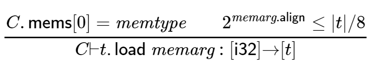
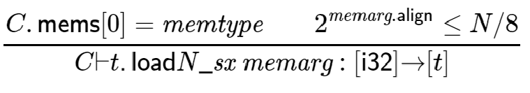
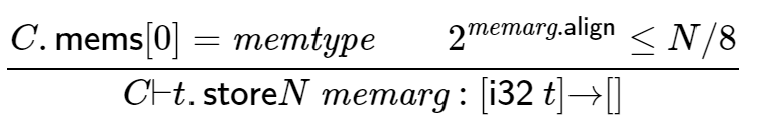
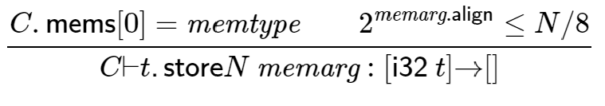

# 表記上のお約束

検証(バリデーション)は、`WebAssembly`モジュールが適格で有効であるか否かを検証します。
適格で有効なモジュールのみをインスタンス化することができます。

有効性はモジュールの抽象構文とその内容に対する型システムによって定義されます。
抽象構文の各部分には、それに適用される制約を指定する型付け規則があります。すべての規則は、2つの等価な形式で与えられます。

- 散文的表記法では、人間にわかりやすい直感的な形で意味を記述します。
- 形式的表記法では、数学的な形式[^1]で規則を記述します。

### 付記

散文的表記法と形式的表記法は等価です。
この仕様書を読むためには形式表記法の理解は必要ありません。
形式的表記法の方がプログラミング言語の意味論で広く使われている記法です。
より簡潔な記述であり、数学的な証明を容易に行うことができます。

---

どちらの場合も、規則は宣言的な方法で定式化されます。
つまり、制約を定式化するだけで、アルゴリズムを定義することはありません。
この仕様に従った命令シーケンスの型チェックのための健全で完全なアルゴリズムの概要が[付録](Appendix)において提供されています。

## 訳注

<a href="Structure#制御命令">\({\mathit{blocktype}}\)</a>はブロックの型を示し、関数型です。

## コンテキスト

個々の定義の有効性は、周囲のモジュールとスコープ内の定義に関する関連情報を収集するコンテキストに対して相対的に指定されます:

- 型:現在のモジュールで定義されている型のリスト。
- 関数:現在のモジュールで宣言された関数のリスト。
- テーブル:現在のモジュールで宣言されたテーブルのリスト。
- メモリ:現在のモジュールで宣言されたメモリのリスト。
- グローバル:現在のモジュールで宣言されているグローバルのリスト。
- ローカル:現在の関数で宣言されたローカルのリスト（パラメータを含む）で、値の型で表されます。
- ラベル:現在の位置からアクセス可能なラベルのスタック。
- 戻り値:現在の関数の戻り値の型で、オプションの結果型として表現されます。

言い換えればコンテキストは各インデックス空間に適した型のシーケンスを含み、その空間で定義された各エントリを記述します。
ローカル、ラベル、戻り値の型は、関数本体の命令を検証するためにのみ使用されそれ以外の場所では空のままにされます。
ラベルスタックはコンテキストの内唯一mutableな部分です。これは命令シーケンスの検証の進行と共に変更されます。

より具体的に言うならば、コンテキストは抽象構文を持つレコード`C`として定義されます。

\[\begin{split}\begin{array}{llll}
\def\mathdef2623#1{{}}\mathdef2623{(context)} &amp; C &amp;::=&amp;
  \begin{array}[t]{l&#64;{~}ll}
  \{ &amp; {\mathsf{types}} &amp; {\mathit{functype}}^\ast, \\
     &amp; {\mathsf{funcs}} &amp; {\mathit{functype}}^\ast, \\
     &amp; {\mathsf{tables}} &amp; {\mathit{tabletype}}^\ast, \\
     &amp; {\mathsf{mems}} &amp; {\mathit{memtype}}^\ast, \\
     &amp; {\mathsf{globals}} &amp; {\mathit{globaltype}}^\ast, \\
     &amp; {\mathsf{locals}} &amp; {\mathit{valtype}}^\ast, \\
     &amp; {\mathsf{labels}} &amp; {\mathit{resulttype}}^\ast, \\
     &amp; {\mathsf{return}} &amp; {\mathit{resulttype}}^? ~\} \\
  \end{array}
\end{array}\end{split}\]

コンテキストを操作する際には、`C.field`という形式のフィールドアクセスに加えて、以下のような表記を採用しています。

<ul>
    <li>コンテキストを綴る際には、空のフィールドは省略します。</li>
    <li>\(C,\mathsf{field}\,A^\ast\)は、\(C\)と同じコンテキストを表しますが、フィールド構成要素のシーケンスの前に要素\(A^\ast\)が付加されています。</li>
</ul>

### 付記

\(C.{\mathsf{labels}}[i]\)のようなインデックス記法を使用して、コンテキスト内のそれぞれのインデックス空間のインデックスを検索します。
コンテキスト拡張記法\(C,\mathsf{field}\,A\)は、主にラベルインデックスのような相対インデックス空間を局所的に拡張するために使用されます。

したがってこの記法は新しい相対インデックス0を導入し、既存のインデックスをシフトしながらそれぞれのシーケンスの先頭に追加するように定義されています。

## 散文的表記法

有効性の検証は、抽象構文の各関連部分のスタイル化された規則によって指定されます。
規則は、フレーズが有効なときに定義される制約を記述するだけでなく、型でそれを分類します。
これらの規則を記述する際には、以下の規約が採用されています。

- フレーズAは、それぞれの規則によって表現されているすべての制約が満たされている場合に限り、"型Tで有効"であると言われます。Tの形は、Aが何であるかに依存します。
- 規則は暗黙のうちに、与えられたコンテキストCを前提としています。
- いくつかの場所ではこのコンテキストは局所的にコンテキストC′に拡張され、追加の項目を持ちます。拡張されたコンテキストで具現化された仮定の下では、次の文が適用されなければならないことを表現するために、"Under context C′, ... statement .... "という定式化が採用されています。

### 付記

例えば、Aが関数であれば、Tは関数型であり、グローバルなAであれば、Tはグローバル型である、などです。

## 形式的表記法

この節では、規則を正式に指定するための表記法について簡単に説明します。
興味のある読者のために、より詳細な紹介はそれぞれの教科書[^2]に掲載されています。

フレーズAがそれぞれの型Tを持つという命題は、A:Tと書かれます。
しかし、一般的には、型付けは文脈Cに依存しています。
これを明示的に表現するために使用される完全な形式は、Cでエンコードされた仮定の下でA:Tが保持されるという判定C⊢A:Tです。

形式的な型付け規則は、型システムを指定するための標準的なアプローチを使用し、それを演繹規則に変換します。
すべての規則は以下の一般的な形式を持っています。

\[\frac{
  \mathit{premise}_1 \qquad \mathit{premise}_2 \qquad \dots \qquad \mathit{premise}_n
}{
  \mathit{conclusion}
}\]

このような規則は、すべての前提条件が成立すれば、結論が成立するという意味合いでおおまかに読まれます。
いくつかの規則には前提条件がないものがあり、それらは結論が無条件に成立する公理です。
結論は常に判断C⊢A:Tであり、抽象構文の関連する構成要素Aごとに1つのそれぞれの規則があります。

### 付記

例えば、`i32.add`命令の型付け規則は公理として与えることができます。

\[\frac{
}{
  C \vdash {\mathsf{i32}}.{\mathsf{add}} : [{\mathsf{i32}}~{\mathsf{i32}}] {\rightarrow} [{\mathsf{i32}}]
}\]

この命令は常に\([{\mathsf{i32}}~{\mathsf{i32}}] {\rightarrow} [{\mathsf{i32}}]\)型で有効です(2つのi32値を消費して1つの値を生成することを意味します)。

`local.get`のような命令は次のように型付けすることができます。

\[\frac{
  C.{\mathsf{locals}}[x] = t
}{
  C \vdash {\mathsf{local.get}}~x : [] {\rightarrow} [t]
}\]

ここでは前提条件は即時ローカルインデックスxがコンテキスト内に存在することを強制します。
命令はそれぞれの型tの値を生成します（値を消費しません）。
\(C.{\mathsf{locals}}[x]\)が存在しない場合、前提条件は保持されず、命令は型が正しくありません。

最後に、構造化命令は再帰的な規則を必要とし、その前提はそれ自体が型付けの判断となります。

\[\frac{
  C \vdash {\mathit{blocktype}} : [t_1^\ast] {\rightarrow} [t_2^\ast]
  \qquad
  C,{\mathsf{label}}\,[t_2^\ast] \vdash {\mathit{instr}}^\ast : [t_1^\ast] {\rightarrow} [t_2^\ast]
}{
  C \vdash {\mathsf{block}}~{\mathit{blocktype}}~{\mathit{instr}}^\ast~{\mathsf{end}} : [t_1^\ast] {\rightarrow} [t_2^\ast]
}\]

ブロック命令はそのボディ内の命令シーケンスが有効な場合にのみ有効となります。
さらに、戻り値型はブロックの注釈で記述された`blocktype`と一致しなければなりません。
そうであれば、ブロック命令はボディと同じ型を持ちます。
ボディの中には、対応する戻り値型に対応する追加ラベルが取得可能です。
これはコンテキスト`C`を前提とした追加ラベル情報で拡張することで表現されます。

# 型

ほとんどの型は普遍的に有効です。
しかし、リミット型には検証時にチェックする必要のある条件があります。
さらにその上、処理を容易にするために、ブロック型は素朴な関数型に変換されます。

## リミット

リミットは、与えられた範囲内で意味のある境界を持っていなければなりません。

<h3>\(\{ {\mathsf{min}}~n, {\mathsf{max}}~m^? \}\)</h3>

<ul class="simple">
    <li>\(n\)は\(k\)より大きい必要があります。</li>
    <li>\(m^?\)が空でないならば:
        <ul>
            <li>\(k\)未満です。</li>
            <li>\(n\)以上です。</li>
        </ul>
    </li>
    <li>以上の条件を満足する時、前提\(k\)の下でこのリミットは有効です。</li>
</ul>

\[\frac{
  n \leq k
  \qquad
  (m \leq k)^?
  \qquad
  (n \leq m)^?
}{
  {\vdash} \{ {\mathsf{min}}~n, {\mathsf{max}}~m^? \} : k
}\]

## ブロック型

ブロック型は2つの形式の内いずれか一方で表現できます。
いずれも次の規則に従うことでプレーンな関数型に変換されます。

<h3>\({\mathit{typeidx}}\)</h3>

- 
\(C.{\mathsf{types}}[{\mathit{typeidx}}]\)はコンテキストに定義されている必要があります。

- 
ブロック型は関数型\(C.{\mathsf{types}}[{\mathit{typeidx}}]\)として有効です。

\[\frac{
  C.{\mathsf{types}}[{\mathit{typeidx}}] = {\mathit{functype}}
}{
  C {\vdash} {\mathit{typeidx}} : {\mathit{functype}}
}\]

<h3>\([{\mathit{valtype}}^?]\)</h3>

<ul>
    <li>ブロック型は関数型\([] {\rightarrow} [{\mathit{valtype}}^?]\)として有効です。</li>
</ul>

\[\frac{
}{
  C {\vdash} [{\mathit{valtype}}^?] : [] {\rightarrow} [{\mathit{valtype}}^?]
}\]

## 関数型

関数型は常に有効です。

<h3>\([t_1^n] {\rightarrow} [t_2^m]\)</h3>

\[\frac{
}{
  {\vdash} [t_1^\ast] {\rightarrow} [t_2^\ast] \mathrel{\mbox{ok}}
}\]

## テーブル型

<h3>\({\mathit{limits}}~{\mathit{elemtype}}\)</h3>

<ul>
    <li>リミット\({\mathit{limits}}\)は\(2^{32}\)を境界条件として与えられます。その上でリミットは有効でなくてはなりません。</li>
    <li>以上の条件を満足する時、これは有効です。</li>
</ul>

\[\frac{
  {\vdash} {\mathit{limits}} : 2^{32}
}{
  {\vdash} {\mathit{limits}}~{\mathit{elemtype}} \mathrel{\mbox{ok}}
}\]

## メモリ型

<h3>\({\mathit{limits}}\)</h3>

<ul>
    <li>リミット\({\mathit{limits}}\)は\(2^{16}\)を境界条件として与えられます。その上でリミットは有効でなくてはなりません。</li>
    <li>以上の条件を満足する時、これは有効です。</li>
</ul>

\[\frac{
  {\vdash} {\mathit{limits}} : 2^{16}
}{
  {\vdash} {\mathit{limits}} \mathrel{\mbox{ok}}
}\]

訳注:Threadでは\({\mathit{share}}\)が追加されています。

## グローバル型

グローバル型は常に有効です。

<h3>\({\mathit{mut}}~{\mathit{valtype}}\)</h3>

\[\frac{
}{
  {\vdash} {\mathit{mut}}~{\mathit{valtype}} \mathrel{\mbox{ok}}
}\]

## 外部型

<h3>\({\mathsf{func}}~{\mathit{functype}}\)</h3>

<ul>
    <li>関数型\({\mathit{functype}}\)は有効でなくてはなりません。</li>
    <li>以上の条件を満足する時、これは有効です。</li>
</ul>

\[\frac{
  {\vdash} {\mathit{functype}} \mathrel{\mbox{ok}}
}{
  {\vdash} {\mathsf{func}}~{\mathit{functype}} \mathrel{\mbox{ok}}
}\]

<h3>\({\mathsf{table}}~{\mathit{tabletype}}\)</h3>

<ul>
    <li>テーブル型\({\mathit{tabletype}}\)は有効でなくてはなりません。</li>
    <li>以上の条件を満足する時、これは有効です。</li>
</ul>

\[\frac{
  {\vdash} {\mathit{tabletype}} \mathrel{\mbox{ok}}
}{
  {\vdash} {\mathsf{table}}~{\mathit{tabletype}} \mathrel{\mbox{ok}}
}\]

<h3>\({\mathsf{mem}}~{\mathit{memtype}}\)</h3>

<ul>
    <li>メモリ型\({\mathit{memtype}}\)は有効でなくてはなりません。</li>
    <li>以上の条件を満足する時、これは有効です。</li>
</ul>

\[\frac{
  {\vdash} {\mathit{memtype}} \mathrel{\mbox{ok}}
}{
  {\vdash} {\mathsf{mem}}~{\mathit{memtype}} \mathrel{\mbox{ok}}
}\]

<h3>\({\mathsf{global}}~{\mathit{globaltype}}\)</h3>

<ul>
    <li>グローバル型\({\mathit{globaltype}}\)は有効でなくてはなりません。</li>
    <li>以上の条件を満足する時、これは有効です。</li>
</ul>

\[\frac{
  {\vdash} {\mathit{globaltype}} \mathrel{\mbox{ok}}
}{
  {\vdash} {\mathsf{global}}~{\mathit{globaltype}} \mathrel{\mbox{ok}}
}\]

# 命令

命令は、オペランドスタックをどのように操作するかを表す関数型\([t_1^\ast] {\rightarrow} [t_2^\ast]\)で分類されます。
これらの型は、命令がポップアップオフする\(t_1^\ast\)型の引数値を持つ必要な入力スタックと、命令がプッシュバックする\(t_2^\ast\)型の結果値を持つ必要な出力スタックを記述しています。

### 付記

例えば\(\mathsf{i32}.\mathsf{add}\)は\([{\mathsf{i32}}~{\mathsf{i32}}] {\rightarrow} [{\mathsf{i32}}]\)型です。
2つの\(\mathsf{i32}\)をpopして1つpushします。

---

型付けは命令シーケンス\({\mathit{instr}}^\ast\)にまで及びます。

このような命令シーケンスを実行することでスタック上に元々あった\(t_1^\ast\)をpopし、実行後に\(t_2^\ast\)を新たにpushするならば関数型\([t_1^\ast] {\rightarrow} [t_2^\ast]\)として表記できます。

幾つかの命令は命令の種類に応じて型を決定するということが出来ません。
このような命令は`ポリモーフィック`であると言えます。

`ポリモーフィズム`にも2種類あります。

<ul>
    <li><em>値のポリモーフィズム</em>:
命令のオペランドである値型\(t\)の型が不定です。
パラメトリック命令\({\mathsf{drop}}\)と\({\mathsf{select}}\)が当てはまります。</li>
    <li><em>スタックのポリモーフィズム</em>:
すべて（あるいは殆どの）関数型\([t_1^\ast] {\rightarrow} [t_2^\ast]\)命令の型は不定です。
すべての制御命令のうち<em>無条件にジャンプするもの</em>、\({\mathsf{unreachable}}\), \({\mathsf{br}}\), \({\mathsf{br\_table}}\), \({\mathsf{return}}\)などが当てはまります。</li>
</ul>

### 付記

たとえば\({\mathsf{select}}\)命令はあらゆる値型\(t\)に対して\([t~t~{\mathsf{i32}}] {\rightarrow} [t]\)として有効な型です。

よって、次の2つの命令について、

\[({\mathsf{i32}}.{\mathsf{const}}~1)~~({\mathsf{i32}}.{\mathsf{const}}~2)~~({\mathsf{i32}}.{\mathsf{const}}~3)~~{\mathsf{select}}{}\]

\[({\mathsf{f64}}.{\mathsf{const}}~1.0)~~({\mathsf{f64}}.{\mathsf{const}}~2.0)~~({\mathsf{i32}}.{\mathsf{const}}~3)~~{\mathsf{select}}{}\]

双方とも有効であり、\({\mathsf{select}}\)により型付けされた\(t\)は\({\mathsf{i32}}\)か\({\mathsf{f64}}\)の一方になります。

\({\mathsf{unreachable}}\)命令は\([t_1^\ast] {\rightarrow} [t_2^\ast]\)という型としてあらゆる\(t_1^\ast\)と\(t_2^\ast\)に対して有効です。

よって、\([] {\rightarrow} [{\mathsf{i32}}~{\mathsf{i32}}]\)であると型が推測される\({\mathsf{unreachable}}\)命令に対して

\[{\mathsf{unreachable}}~~{\mathsf{i32}}.{\mathsf{add}}\]

は有効です。

対照的に、同一のスタック上においては、

\[{\mathsf{unreachable}}~~({\mathsf{i64}}.{\mathsf{const}}~0)~~{\mathsf{i32}}.{\mathsf{add}}\]

は無効です。

何故ならば\({\mathsf{unreachable}}\)命令に対して適切な型付けが出来ないからです。

## 算術演算命令

<h3>\(t\mathsf{.}{\mathsf{const}}~c\)</h3>

<ul>
    <li>この命令は有効です。\([] {\rightarrow} [t]\)。</li>
</ul>

\[\frac{
}{
  C {\vdash} t\mathsf{.}{\mathsf{const}}~c : [] {\rightarrow} [t]
}\]

<h3>\(t\mathsf{.}{\mathit{unop}}\)</h3>

<ul>
    <li>この命令は有効です。\([t] {\rightarrow} [t]\)。</li>
</ul>

\[\frac{
}{
  C {\vdash} t\mathsf{.}{\mathit{unop}} : [t] {\rightarrow} [t]
}\]

<h3>\(t\mathsf{.}{\mathit{binop}}\)</h3>

<ul>
    <li>この命令は有効です。\([t~t] {\rightarrow} [t]\)。</li>
</ul>

\[\frac{
}{
  C {\vdash} t\mathsf{.}{\mathit{binop}} : [t~t] {\rightarrow} [t]
}\]

<h3>\(t\mathsf{.}{\mathit{testop}}\)</h3>

<ul>
    <li>この命令は有効です。\([t] {\rightarrow} [{\mathsf{i32}}]\)。</li>
</ul>

\[\frac{
}{
  C {\vdash} t\mathsf{.}{\mathit{testop}} : [t] {\rightarrow} [{\mathsf{i32}}]
}\]

<h3>\(t\mathsf{.}{\mathit{relop}}\)</h3>

<ul>
    <li>この命令は有効です。\([t~t] {\rightarrow} [{\mathsf{i32}}]\)。</li>
</ul>

\[\frac{
}{
  C {\vdash} t\mathsf{.}{\mathit{relop}} : [t~t] {\rightarrow} [{\mathsf{i32}}]
}\]

<h3>\(t_2\mathsf{.}{\mathit{cvtop}}\mathsf{\_}t_1\mathsf{\_}{\mathit{sx}}^?\)</h3>

<ul>
    <li>この命令は有効です。\([t_1] {\rightarrow} [t_2]\)。</li>
</ul>

\[\frac{
}{
  C {\vdash} t_2\mathsf{.}{\mathit{cvtop}}\mathsf{\_}t_1\mathsf{\_}{\mathit{sx}}^? : [t_1] {\rightarrow} [t_2]
}\]

## パラメトリック命令

<h3>\({\mathsf{drop}}\)</h3>

<ul>
    <li>この命令は有効です。\(t\)を値型として、\([t] {\rightarrow} []\)。</li>
</ul>

\[\frac{
}{
  C {\vdash} {\mathsf{drop}} : [t] {\rightarrow} []
}\]

<h3>\({\mathsf{select}}\)</h3>

<ul>
    <li>この命令は有効です。\(t\)を値型として、\([t~t~{\mathsf{i32}}] {\rightarrow} [t]\)。</li>
</ul>

\[\frac{
}{
  C {\vdash} {\mathsf{select}} : [t~t~{\mathsf{i32}}] {\rightarrow} [t]
}\]

### 付記

`drop`と`select`の両方とも`値のポリモーフィズム`を満たす命令です。

## 変数命令

<h3>\({\mathsf{local.get}}~x\)</h3>

<ul>
    <li>ローカル変数\(C.{\mathsf{locals}}[x]\)はコンテキスト中に定義されていなければなりません。</li>
    <li>\(t\)は値型\(C.{\mathsf{locals}}[x]\)であるとします。</li>
    <li>以上の条件を満足する時、この命令は有効です。\([] {\rightarrow} [t]\)。</li>
</ul>

\[\frac{
  C.{\mathsf{locals}}[x] = t
}{
  C {\vdash} {\mathsf{local.get}}~x : [] {\rightarrow} [t]
}\]

<h3>\({\mathsf{local.set}}~x\)</h3>

<ul>
    <li>ローカル変数\(C.{\mathsf{locals}}[x]\)はコンテキスト中に定義されていなければなりません。</li>
    <li>\(t\)は値型\(C.{\mathsf{locals}}[x]\)であるとします。</li>
    <li>以上の条件を満足する時、この命令は有効です。\([t] {\rightarrow} []\)。</li>
</ul>

\[\frac{
  C.{\mathsf{locals}}[x] = t
}{
  C {\vdash} {\mathsf{local.set}}~x : [t] {\rightarrow} []
}\]

<h3>\({\mathsf{local.tee}}~x\)</h3>

<ul>
    <li>ローカル変数\(C.{\mathsf{locals}}[x]\)はコンテキスト中に定義されていなければなりません。</li>
    <li>\(t\)は値型\(C.{\mathsf{locals}}[x]\)であるとします。</li>
    <li>以上の条件を満足する時、この命令は有効です。\([t] {\rightarrow} [t]\)。</li>
</ul>

\[\frac{
  C.{\mathsf{locals}}[x] = t
}{
  C {\vdash} {\mathsf{local.tee}}~x : [t] {\rightarrow} [t]
}\]

<h3>\({\mathsf{global.get}}~x\)</h3>

<ul>
    <li>グローバル変数\(C.{\mathsf{globals}}[x]\)はコンテキスト中に定義されていなければなりません。</li>
    <li>\({\mathit{mut}}~t\)はグローバル型 \(C.{\mathsf{globals}}[x]\)であるとします。</li>
    <li>以上の条件を満足する時、この命令は有効です。\([] {\rightarrow} [t]\)。</li>
</ul>

\[\frac{
  C.{\mathsf{globals}}[x] = {\mathit{mut}}~t
}{
  C {\vdash} {\mathsf{global.get}}~x : [] {\rightarrow} [t]
}\]

<h3>\({\mathsf{global.set}}~x\)</h3>

<ul>
    <li>グローバル変数\(C.{\mathsf{globals}}[x]\)はコンテキスト中に定義されていなければなりません。</li>
    <li>\({\mathit{mut}}~t\)はグローバル型 \(C.{\mathsf{globals}}[x]\)であるとします。</li>
    <li>\({\mathit{mut}}\)が\({\mathsf{var}}\)であるとします。</li>
    <li>以上の条件を満足する時、この命令は有効です。\([t] {\rightarrow} []\)。</li>
</ul>

\[\frac{
  C.{\mathsf{globals}}[x] = {\mathsf{var}}~t
}{
  C {\vdash} {\mathsf{global.set}}~x : [t] {\rightarrow} []
}\]

## メモリ命令

<h3>\(t\mathsf{.}{\mathsf{load}}~{\mathit{memarg}}\)</h3>

<ul>
    <li>メモリ\(C.{\mathsf{mems}}[0]\)はコンテキスト中に定義されていなければなりません。</li>
    <li>アラインメント\(2^{{\mathit{memarg}}.{\mathsf{align}}\)は\(t\)のbit幅を\(8\)で除算したもの以下です。</li>
    <li>以上の条件を満足する時、この命令は有効です。\([{\mathsf{i32}}] {\rightarrow} [t]\)。</li>
</ul>

訳注:何故かGoogle Chromeではmathjaxが適切に数式を解釈してくれないのでpngファイルを設置します。大きさが異なり申し訳ないです。

<h3>\(t\mathsf{.}{\mathsf{load}}{N}\mathsf{\_}{\mathit{sx}}~{\mathit{memarg}}\)</h3>

<ul>
    <li>メモリ\(C.{\mathsf{mems}}[0]\)はコンテキスト中に定義されていなければなりません。</li>
    <li>アラインメント\(2^{{\mathit{memarg}}.{\mathsf{align}}\)は\(N/8\)以下です。</li>
    <li>以上の条件を満足する時、この命令は有効です。\([{\mathsf{i32}}] {\rightarrow} [t]\)。</li>
</ul>

<h3>\(t\mathsf{.}{\mathsf{store}}~{\mathit{memarg}}\)</h3>

<ul>
    <li>メモリ\(C.{\mathsf{mems}}[0]\)はコンテキスト中に定義されていなければなりません。</li>
    <li>アラインメント\(2^{{\mathit{memarg}}.{\mathsf{align}}\)は\(t\)のbit幅を\(8\)で除算したもの以下です。</li>
    <li>以上の条件を満足する時、この命令は有効です。\([{\mathsf{i32}}~t] {\rightarrow} []\)。</li>
</ul>

<h3>\(t\mathsf{.}{\mathsf{store}}{N}~{\mathit{memarg}}\)</h3>

<ul>
    <li>メモリ\(C.{\mathsf{mems}}[0]\)はコンテキスト中に定義されていなければなりません。</li>
    <li>アラインメント\(2^{{\mathit{memarg}}.{\mathsf{align}}\)は\(N/8\)以下です。</li>
    <li>以上の条件を満足する時、この命令は有効です。\([{\mathsf{i32}}~t] {\rightarrow} []\)。</li>
</ul>

<h3>\({\mathsf{memory.size}}\)</h3>

<ul>
    <li>メモリ\(C.{\mathsf{mems}}[0]\)はコンテキスト中に定義されていなければなりません。</li>
    <li>以上の条件を満足する時、この命令は有効です。\([] {\rightarrow} [{\mathsf{i32}}]\)。</li>
</ul>

\[\frac{
  C.{\mathsf{mems}}[0] = {\mathit{memtype}}
}{
  C {\vdash} {\mathsf{memory.size}} : [] {\rightarrow} [{\mathsf{i32}}]
}\]

<h3>\({\mathsf{memory.grow}}\)</h3>

<ul>
    <li>メモリ\(C.{\mathsf{mems}}[0]\)はコンテキスト中に定義されていなければなりません。</li>
    <li>以上の条件を満足する時、この命令は有効です。\([{\mathsf{i32}}] {\rightarrow} [{\mathsf{i32}}]\)。</li>
</ul>

\[\frac{
  C.{\mathsf{mems}}[0] = {\mathit{memtype}}
}{
  C {\vdash} {\mathsf{memory.grow}} : [{\mathsf{i32}}] {\rightarrow} [{\mathsf{i32}}]
}\]

## 制御命令

<h3>\({\mathsf{nop}}\)</h3>

<ul>
    <li>この命令は有効です。\([] {\rightarrow} []\)。</li>
</ul>

\[\frac{
}{
  C {\vdash} {\mathsf{nop}} : [] {\rightarrow} []
}\]

<h3>\({\mathsf{unreachable}}\)</h3>

<ul>
    <li>この命令は有効です。あらゆる値型のシーケンス\(t_1^\ast\)と\(t_2^\ast\)に対して\([t_1^\ast] {\rightarrow} [t_2^\ast]\)。</li>
</ul>

\[\frac{
}{
  C {\vdash} {\mathsf{unreachable}} : [t_1^\ast] {\rightarrow} [t_2^\ast]
}\]

### 付記

\({\mathsf{unreachable}}\)

---

<h3>\({\mathsf{block}}~{\mathit{blocktype}}~{\mathit{instr}}^\ast~{\mathsf{end}}\)</h3>

<ul>
    <li>ブロック型は有効関数型\([t_1^\ast] {\rightarrow} [t_2^\ast]\)として有効でなくてはなりません。</li>
    <li>コンテキスト\(C'\)をコンテキスト\(C\)と同一であるとしますが、しかし戻り値型\([t_2^\ast]\)がラベルベクトル\({\mathsf{labels}}\)の前に付加されているとします。</li>
    <li>コンテキスト\(C'\)を前提として、命令シーケンス\({\mathit{instr}}^\ast\)は型\([t_1^\ast] {\rightarrow} [t_2^\ast]\)として有効であるとします。</li>
    <li>以上の条件を満足する時、複合命令は有効です。\([t_1^\ast] {\rightarrow} [t_2^\ast]\)。</li>
</ul>

\[\frac{
  C {\vdash} {\mathit{blocktype}} : [t_1^\ast] {\rightarrow} [t_2^\ast]
  \qquad
  C,{\mathsf{labels}}\,[t_2^\ast] {\vdash} {\mathit{instr}}^\ast : [t_1^\ast] {\rightarrow} [t_2^\ast]
}{
  C {\vdash} {\mathsf{block}}~{\mathit{blocktype}}~{\mathit{instr}}^\ast~{\mathsf{end}} : [t_1^\ast] {\rightarrow} [t_2^\ast]
}\]

### 付記

コンテキスト\(C,{\mathsf{labels}}\,[t^\ast]\)はラベル型をインデックス\(0\)に挿入し、他をずらします。

---

<h3>\({\mathsf{loop}}~{\mathit{blocktype}}~{\mathit{instr}}^\ast~{\mathsf{end}}\)</h3>

<ul>
    <li>ブロック型は有効関数型\([t_1^\ast] {\rightarrow} [t_2^\ast]\)として有効でなくてはなりません。</li>
    <li>コンテキスト\(C'\)をコンテキスト\(C\)と同一であるとしますが、しかし戻り値型\([t_2^\ast]\)がラベルベクトル\({\mathsf{labels}}\)の前に付加されているとします。</li>
    <li>コンテキスト\(C'\)を前提として、命令シーケンス\({\mathit{instr}}^\ast\)は型\([t_1^\ast] {\rightarrow} [t_2^\ast]\)として有効であるとします。</li>
    <li>以上の条件を満足する時、複合命令は有効です。\([t_1^\ast] {\rightarrow} [t_2^\ast]\)。</li>
</ul>

\[\frac{
  C {\vdash} {\mathit{blocktype}} : [t_1^\ast] {\rightarrow} [t_2^\ast]
  \qquad
  C,{\mathsf{labels}}\,[t_1^\ast] {\vdash} {\mathit{instr}}^\ast : [t_1^\ast] {\rightarrow} [t_2^\ast]
}{
  C {\vdash} {\mathsf{loop}}~{\mathit{blocktype}}~{\mathit{instr}}^\ast~{\mathsf{end}} : [t_1^\ast] {\rightarrow} [t_2^\ast]
}\]

### 付記

コンテキスト\(C,{\mathsf{labels}}\,[t^\ast]\)はラベル型をインデックス\(0\)に挿入し、他をずらします。

---

<h3>\({\mathsf{if}}~{\mathit{blocktype}}~{\mathit{instr}}_1^\ast~{\mathsf{else}}~{\mathit{instr}}_2^\ast~{\mathsf{end}}\)</h3>

<ul>
    <li>ブロック型は有効関数型\([t_1^\ast] {\rightarrow} [t_2^\ast]\)として有効でなくてはなりません。</li>
    <li>コンテキスト\(C'\)をコンテキスト\(C\)と同一であるとしますが、しかし戻り値型\([t_2^\ast]\)がラベルベクトル\({\mathsf{labels}}\)の前に付加されているとします。</li>
    <li>コンテキスト\(C'\)を前提として、命令シーケンス\({\mathit{instr}}_1^\ast\)は型\([t_1^\ast] {\rightarrow} [t_2^\ast]\)として有効であるとします。</li>
    <li>コンテキスト\(C'\)を前提として、命令シーケンス\({\mathit{instr}}_2^\ast\)は型\([t_1^\ast] {\rightarrow} [t_2^\ast]\)として有効であるとします。</li>
    <li>以上の条件を満足する時、複合命令は有効です。\([t_1^\ast~{\mathsf{i32}}] {\rightarrow} [t_2^\ast]\)。</li>
</ul>

\[\frac{
  C {\vdash} {\mathit{blocktype}} : [t_1^\ast] {\rightarrow} [t_2^\ast]
  \qquad
  C,{\mathsf{labels}}\,[t_2^\ast] {\vdash} {\mathit{instr}}_1^\ast : [t_1^\ast] {\rightarrow} [t_2^\ast]
  \qquad
  C,{\mathsf{labels}}\,[t_2^\ast] {\vdash} {\mathit{instr}}_2^\ast : [t_1^\ast] {\rightarrow} [t_2^\ast]
}{
  C {\vdash} {\mathsf{if}}~{\mathit{blocktype}}~{\mathit{instr}}_1^\ast~{\mathsf{else}}~{\mathit{instr}}_2^\ast~{\mathsf{end}} : [t_1^\ast~{\mathsf{i32}}] {\rightarrow} [t_2^\ast]
}\]

### 付記

コンテキスト\(C,{\mathsf{labels}}\,[t^\ast]\)はラベル型をインデックス\(0\)に挿入し、他をずらします。

---

<h3>\({\mathsf{br}}~l\)</h3>

<ul>
    <li>ラベル\(C.{\mathsf{labels}}[l]\)はコンテキスト中に定義されていなければなりません。</li>
    <li>\([t^\ast]\)は戻り値型\(C.{\mathsf{labels}}[l]\)であるとします。</li>
    <li>以上の条件を満足する時、この命令は有効です。\([t_1^\ast~t^\ast] {\rightarrow} [t_2^\ast]\), for any sequences of 値型 \(t_1^\ast\) and \(t_2^\ast\)。</li>
</ul>

\[\frac{
  C.{\mathsf{labels}}[l] = [t^\ast]
}{
  C {\vdash} {\mathsf{br}}~l : [t_1^\ast~t^\ast] {\rightarrow} [t_2^\ast]
}\]

<h3>\({\mathsf{br\_if}}~l\)</h3>

<ul>
    <li>ラベル\(C.{\mathsf{labels}}[l]\)はコンテキスト中に定義されていなければなりません。</li>
    <li>\([t^\ast]\)は戻り値型\(C.{\mathsf{labels}}[l]\)であるとします。</li>
    <li>以上の条件を満足する時、この命令は有効です。\([t^\ast~{\mathsf{i32}}] {\rightarrow} [t^\ast]\)。</li>
</ul>

\[\frac{
  C.{\mathsf{labels}}[l] = [t^\ast]
}{
  C {\vdash} {\mathsf{br\_if}}~l : [t^\ast~{\mathsf{i32}}] {\rightarrow} [t^\ast]
}\]

<h3>\({\mathsf{br\_table}}~l^\ast~l_N\)</h3>

<ul>
    <li>ラベル\(C.{\mathsf{labels}}[l_N]\)はコンテキスト中に定義されていなければなりません。</li>
    <li>\([t^\ast]\)は戻り値型 \(C.{\mathsf{labels}}[l_N]\)であるとします。</li>
    <li>全ての\(l^\ast\)中の\(l_i\)について、ラベル\(C.{\mathsf{labels}}[l_i]\)はコンテキスト中に定義されていなければなりません。</li>
    <li>全ての\(l^\ast\)中の\(l_i\)について、ラベル\(C.{\mathsf{labels}}[l_i]\)は\([t^\ast]\)でなければなりません。</li>
    <li>以上の条件を満足する時、この命令は有効です。あらゆる値型のシーケンス\(t_1^\ast\)と\(t_2^\ast\)に対して\([t_1^\ast~t^\ast] {\rightarrow} [t_2^\ast]\)。</li>
</ul>

\[\frac{
  (C.{\mathsf{labels}}[l] = [t^\ast])^\ast
  \qquad
  C.{\mathsf{labels}}[l_N] = [t^\ast]
}{
  C {\vdash} {\mathsf{br\_table}}~l^\ast~l_N : [t_1^\ast~t^\ast~{\mathsf{i32}}] {\rightarrow} [t_2^\ast]
}\]

<h3>\({\mathsf{return}}\)</h3>

<ul>
    <li>戻り値型\(C.{\mathsf{return}}\)はコンテキスト中に定義されていなければなりません。</li>
    <li>\([t^\ast]\)が\(C.{\mathsf{return}}\)の戻り値型であるとします。</li>
    <li>以上の条件を満足する時、この命令は有効です。あらゆる値型のシーケンス\(t_1^\ast\)と\(t_2^\ast\)に対して\([t_1^\ast~t^\ast] {\rightarrow} [t_2^\ast]\)。</li>
</ul>

\[\frac{
  C.{\mathsf{return}} = [t^\ast]
}{
  C {\vdash} {\mathsf{return}} : [t_1^\ast~t^\ast] {\rightarrow} [t_2^\ast]
}\]

<h3>\({\mathsf{call}}~x\)</h3>

<ul>
    <li>関数\(C.{\mathsf{funcs}}[x]\)はコンテキスト中に定義されていなければなりません。</li>
    <li>以上の条件を満足する時、この命令は有効です。\(C.{\mathsf{funcs}}[x]\)。</li>
</ul>

\[\frac{
  C.{\mathsf{funcs}}[x] = [t_1^\ast] {\rightarrow} [t_2^\ast]
}{
  C {\vdash} {\mathsf{call}}~x : [t_1^\ast] {\rightarrow} [t_2^\ast]
}\]

<h3>\({\mathsf{call\_indirect}}~x\)</h3>

<ul>
    <li>テーブル\(C.{\mathsf{tables}}[0]\)はコンテキスト中に定義されていなければなりません。</li>
    <li>\({\mathit{limits}}~{\mathit{elemtype}}\)がテーブル型\(C.{\mathsf{tables}}[0]\)であるとします。</li>
    <li>要素型\({\mathit{elemtype}}\)は\({\mathsf{funcref}}\)でなければなりません。</li>
    <li>型\(C.{\mathsf{types}}[x]\)はコンテキスト中に定義されていなければなりません。</li>
    <li>\([t_1^\ast] {\rightarrow} [t_2^\ast]\)が関数型\(C.{\mathsf{types}}[x]\)であるとします。</li>
    <li>以上の条件を満足する時、この命令は有効です。\([t_1^\ast~{\mathsf{i32}}] {\rightarrow} [t_2^\ast]\)。</li>
</ul>

\[\frac{
  C.{\mathsf{tables}}[0] = {\mathit{limits}}~{\mathsf{funcref}}
  \qquad
  C.{\mathsf{types}}[x] = [t_1^\ast] {\rightarrow} [t_2^\ast]
}{
  C {\vdash} {\mathsf{call\_indirect}}~x : [t_1^\ast~{\mathsf{i32}}] {\rightarrow} [t_2^\ast]
}\]

## 命令シーケンス

<h3>空の命令シーケンス: \(\epsilon\)</h3>

<ul>
    <li>空の命令シーケンスはあらゆる値型のシーケンス\(t^\ast\)に対して型\([t^\ast] {\rightarrow} [t^\ast]\)として有効です。</li>
</ul>

\[\frac{
}{
  C {\vdash} \epsilon : [t^\ast] {\rightarrow} [t^\ast]
}\]

<h3>空でない命令シーケンス: \({\mathit{instr}}^\ast~{\mathit{instr}}_N\)</h3>

<ul>
    <li>命令シーケンス\({\mathit{instr}}^\ast\)はある種の値型のシーケンス\(t_1^\ast\)と\(t_2^\ast\)に対して型\([t_1^\ast] {\rightarrow} [t_2^\ast]\)として有効です。</li>
    <li>命令\({\mathit{instr}}_N\)はある種の値型のシーケンス\(t^\ast\)と\(t_3^\ast\)に対して型\([t^\ast] {\rightarrow} [t_3^\ast]\)として有効です。</li>
    <li>\(t_2^\ast = t_0^\ast~t^\ast\)のような値型のシーケンス\(t_0^\ast\)が存在せねばなりません。</li>
    <li>以上の条件を満足する時、複合命令シーケンスは型\([t_1^\ast] {\rightarrow} [t_0^\ast~t_3^\ast]\)として有効です。</li>
</ul>

\[\frac{
  C {\vdash} {\mathit{instr}}^\ast : [t_1^\ast] {\rightarrow} [t_0^\ast~t^\ast]
  \qquad
  C {\vdash} {\mathit{instr}}_N : [t^\ast] {\rightarrow} [t_3^\ast]
}{
  C {\vdash} {\mathit{instr}}^\ast~{\mathit{instr}}_N : [t_1^\ast] {\rightarrow} [t_0^\ast~t_3^\ast]
}\]

## 式

式は戻り値型\([t^\ast]\)として有効です。

<h3>\({\mathit{instr}}^\ast~{\mathsf{end}}\)</h3>

<ul>
    <li>命令シーケンス\({\mathit{instr}}^\ast\)はいくつかの戻り値型\([t^\ast]\)に対して型\([] {\rightarrow} [t^\ast]\)として有効です。</li>
    <li>以上の条件を満足する時、式は戻り値型\([t^\ast]\)として有効です。</li>
</ul>

\[\frac{
  C {\vdash} {\mathit{instr}}^\ast : [] {\rightarrow} [t^\ast]
}{
  C {\vdash} {\mathit{instr}}^\ast~{\mathsf{end}} : [t^\ast]
}\]

### 定数式

<ul>
    <li>定数式\({\mathit{instr}}^\ast~{\mathsf{end}}\)中の全ての命令\({\mathit{instr}}^\ast\)は定数でなければなりません。</li>
    <li>定数命令\({\mathit{instr}}\)は必ず:
        <ul>
            <li>いずれかの形式を取る命令\(t.{\mathsf{const}}~c\)であるか、</li>
            <li>もしくは、形式\({\mathsf{global.get}}~x\)を取ります。この場合\(C.{\mathsf{globals}}[x]\)は必ずグローバル型\({\mathsf{const}}~t\)でなければなりません。</li>
        </ul>
    </li>
</ul>

\[\frac{
  (C {\vdash} {\mathit{instr}} {\mathrel{\mbox{const}}})^\ast
}{
  C {\vdash} {\mathit{instr}}^\ast~{\mathsf{end}} {\mathrel{\mbox{const}}}
}\]

\[\frac{
}{
  C {\vdash} t.{\mathsf{const}}~c {\mathrel{\mbox{const}}}
}
\qquad
\frac{
  C.{\mathsf{globals}}[x] = {\mathsf{const}}~t
}{
  C {\vdash} {\mathsf{global.get}}~x {\mathrel{\mbox{const}}}
}\]

### 付記

現在、グローバルの初期化子として発生する定数式は含まれる`global.get`命令がインポートされたグローバルを参照することしかできないという制約があります。
これはコンテキスト`C`を制約することで、モジュールの検証ルールで強制されます。

定数式の定義は、WebAssembly の将来のバージョンで拡張される可能性があります。

# モジュール

## 関数

<h3>\(\{ {\mathsf{type}}~x, {\mathsf{locals}}~t^\ast, {\mathsf{body}}~{\mathit{expr}} \}\)</h3>
<ul>
    <li>The type \(C.{\mathsf{types}}[x]\)はコンテキスト中に定義されていなければなりません。</li>
    <li>Let \([t_1^\ast] {\rightarrow} [t_2^\ast]\) be the 関数型\(C.{\mathsf{types}}[x]\)。</li>
    <li>Let \(C'\) be the same コンテキスト as \(C\),
but with:
<ul>
    <li>\({\mathsf{locals}}\) set to the sequence of 値型 \(t_1^\ast~t^\ast\), concatenating parameters and locals,</li>
    <li>\({\mathsf{labels}}\) set to the singular sequence containing only 戻り値型 \([t_2^\ast]\)。</li>
    <li>\({\mathsf{return}}\) set to the 戻り値型 \([t_2^\ast]\)。</li>
</ul>
</li>
    <li>Under the context \(C'\),
the expression \({\mathit{expr}}\) must be valid with type \([t_2^\ast]\)。</li>
    <li>以上の条件を満足する時、関数定義は有効です。\([t_1^\ast] {\rightarrow} [t_2^\ast]\)。</li>
</ul>

\[\frac{
  C.{\mathsf{types}}[x] = [t_1^\ast] {\rightarrow} [t_2^\ast]
  \qquad
  C,{\mathsf{locals}}\,t_1^\ast~t^\ast,{\mathsf{labels}}~[t_2^\ast],{\mathsf{return}}~[t_2^\ast] {\vdash} {\mathit{expr}} : [t_2^\ast]
}{
  C {\vdash} \{ {\mathsf{type}}~x, {\mathsf{locals}}~t^\ast, {\mathsf{body}}~{\mathit{expr}} \} : [t_1^\ast] {\rightarrow} [t_2^\ast]
}\]

## テーブル

<h3>\(\{ {\mathsf{type}}~{\mathit{tabletype}} \}\)</h3>
<ul>
    <li>The テーブル型 \({\mathit{tabletype}}\)は有効でなくてはなりません。</li>
    <li>以上の条件を満足する時、テーブル定義は有効です。\({\mathit{tabletype}}\)。</li>
</ul>

\[\frac{
  {\vdash} {\mathit{tabletype}} \mathrel{\mbox{ok}}
}{
  C {\vdash} \{ {\mathsf{type}}~{\mathit{tabletype}} \} : {\mathit{tabletype}}
}\]

## メモリ

<h3>\(\{ {\mathsf{type}}~{\mathit{memtype}} \}\)</h3>
<ul>
    <li>The メモリ型 \({\mathit{memtype}}\)は有効でなくてはなりません。</li>
    <li>以上の条件を満足する時、メモリ定義は有効です。\({\mathit{memtype}}\)。</li>
</ul>

\[\frac{
  {\vdash} {\mathit{memtype}} \mathrel{\mbox{ok}}
}{
  C {\vdash} \{ {\mathsf{type}}~{\mathit{memtype}} \} : {\mathit{memtype}}
}\]

## グローバル

<h3>\(\{ {\mathsf{type}}~{\mathit{mut}}~t, {\mathsf{init}}~{\mathit{expr}} \}\)</h3>
<ul>
    <li>The グローバル型 \({\mathit{mut}}~t\)は有効でなくてはなりません。</li>
    <li>The expression \({\mathit{expr}}\) must be 有効 with 戻り値型 \([t]\)。</li>
    <li>The expression \({\mathit{expr}}\) must be 定数。</li>
    <li>以上の条件を満足する時、グローバル定義は有効です。\({\mathit{mut}}~t\)。</li>
</ul>

\[\frac{
  {\vdash} {\mathit{mut}}~t \mathrel{\mbox{ok}}
  \qquad
  C {\vdash} {\mathit{expr}} : [t]
  \qquad
  C {\vdash} {\mathit{expr}} {\mathrel{\mbox{const}}}
}{
  C {\vdash} \{ {\mathsf{type}}~{\mathit{mut}}~t, {\mathsf{init}}~{\mathit{expr}} \} : {\mathit{mut}}~t
}\]

## Elementセグメント

<h3>\(\{ {\mathsf{table}}~x, {\mathsf{offset}}~{\mathit{expr}}, {\mathsf{init}}~y^\ast \}\)</h3>
<ul>
    <li>テーブル\(C.{\mathsf{tables}}[x]\)はコンテキスト中に定義されていなければなりません。</li>
    <li>Let \({\mathit{limits}}~{\mathit{elemtype}}\) be the テーブル型 \(C.{\mathsf{tables}}[x]\)。</li>
    <li>要素型\({\mathit{elemtype}}\) must be \({\mathsf{funcref}}\)。</li>
    <li>The expression \({\mathit{expr}}\) must be 有効 with 戻り値型 \([{\mathsf{i32}}]\)。</li>
    <li>The expression \({\mathit{expr}}\) must be 定数。</li>
    <li>For each \(y_i\) in \(y^\ast\),
関数\(C.{\mathsf{funcs}}[y]\)はコンテキスト中に定義されていなければなりません。</li>
    <li>以上の条件を満足する時、the element segment is valid。</li>
</ul>

\[\frac{
  C.{\mathsf{tables}}[x] = {\mathit{limits}}~{\mathsf{funcref}}
  \qquad
  C {\vdash} {\mathit{expr}} : [{\mathsf{i32}}]
  \qquad
  C {\vdash} {\mathit{expr}} {\mathrel{\mbox{const}}}
  \qquad
  (C.{\mathsf{funcs}}[y] = {\mathit{functype}})^\ast
}{
  C {\vdash} \{ {\mathsf{table}}~x, {\mathsf{offset}}~{\mathit{expr}}, {\mathsf{init}}~y^\ast \} \mathrel{\mbox{ok}}
}\]

## Dataセグメント

<h3>\(\{ {\mathsf{data}}~x, {\mathsf{offset}}~{\mathit{expr}}, {\mathsf{init}}~b^\ast \}\)</h3>
<ul>
    <li>メモリ\(C.{\mathsf{mems}}[x]\)はコンテキスト中に定義されていなければなりません。</li>
    <li>The expression \({\mathit{expr}}\) must be 有効 with 戻り値型 \([{\mathsf{i32}}]\)。</li>
    <li>The expression \({\mathit{expr}}\) must be 定数。</li>
    <li>以上の条件を満足する時、the data segment is valid。</li>
</ul>

\[\frac{
  C.{\mathsf{mems}}[x] = {\mathit{limits}}
  \qquad
  C {\vdash} {\mathit{expr}} : [{\mathsf{i32}}]
  \qquad
  C {\vdash} {\mathit{expr}} {\mathrel{\mbox{const}}}
}{
  C {\vdash} \{ {\mathsf{data}}~x, {\mathsf{offset}}~{\mathit{expr}}, {\mathsf{init}}~b^\ast \} \mathrel{\mbox{ok}}
}\]

## 開始関数

<h3>\(\{ {\mathsf{func}}~x \}\)</h3>
<ul>
    <li>関数\(C.{\mathsf{funcs}}[x]\)はコンテキスト中に定義されていなければなりません。</li>
    <li>The type of \(C.{\mathsf{funcs}}[x]\) must be \([] {\rightarrow} []\)。</li>
    <li>以上の条件を満足する時、the start function is valid。</li>
</ul>

\[\frac{
  C.{\mathsf{funcs}}[x] = [] {\rightarrow} []
}{
  C {\vdash} \{ {\mathsf{func}}~x \} \mathrel{\mbox{ok}}
}\]

## Export

<h3>\(\{ {\mathsf{name}}~{\mathit{name}}, {\mathsf{desc}}~{\mathit{exportdesc}} \}\)</h3>
<ul>
    <li>The export description \({\mathit{exportdesc}}\) must be valid with 外部型 \({\mathit{externtype}}\)。</li>
    <li>以上の条件を満足する時、the export is valid with 外部型 \({\mathit{externtype}}\)。</li>
</ul>

\[\frac{
  C {\vdash} {\mathit{exportdesc}} : {\mathit{externtype}}
}{
  C {\vdash} \{ {\mathsf{name}}~{\mathit{name}}, {\mathsf{desc}}~{\mathit{exportdesc}} \} : {\mathit{externtype}}
}\]

<h3>\({\mathsf{func}}~x\)</h3>
<ul>
    <li>関数\(C.{\mathsf{funcs}}[x]\)はコンテキスト中に定義されていなければなりません。</li>
    <li>以上の条件を満足する時、the export description is valid with 外部型 \({\mathsf{func}}~C.{\mathsf{funcs}}[x]\)。</li>
</ul>

\[\frac{
  C.{\mathsf{funcs}}[x] = {\mathit{functype}}
}{
  C {\vdash} {\mathsf{func}}~x : {\mathsf{func}}~{\mathit{functype}}
}\]

<h3>\({\mathsf{table}}~x\)</h3>
<ul>
    <li>テーブル\(C.{\mathsf{tables}}[x]\)はコンテキスト中に定義されていなければなりません。</li>
    <li>以上の条件を満足する時、the export description is valid with 外部型 \({\mathsf{table}}~C.{\mathsf{tables}}[x]\)。</li>
</ul>

\[\frac{
  C.{\mathsf{tables}}[x] = {\mathit{tabletype}}
}{
  C {\vdash} {\mathsf{table}}~x : {\mathsf{table}}~{\mathit{tabletype}}
}\]

<h3>\({\mathsf{mem}}~x\)</h3>
<ul>
    <li>メモリ\(C.{\mathsf{mems}}[x]\)はコンテキスト中に定義されていなければなりません。</li>
    <li>以上の条件を満足する時、the export description is valid with 外部型 \({\mathsf{mem}}~C.{\mathsf{mems}}[x]\)。</li>
</ul>

\[\frac{
  C.{\mathsf{mems}}[x] = {\mathit{memtype}}
}{
  C {\vdash} {\mathsf{mem}}~x : {\mathsf{mem}}~{\mathit{memtype}}
}\]

<h3>\({\mathsf{global}}~x\)</h3>
<ul>
    <li>The global \(C.{\mathsf{globals}}[x]\)はコンテキスト中に定義されていなければなりません。</li>
    <li>以上の条件を満足する時、the export description is valid with 外部型 \({\mathsf{global}}~C.{\mathsf{globals}}[x]\)。</li>
</ul>

\[\frac{
  C.{\mathsf{globals}}[x] = {\mathit{globaltype}}
}{
  C {\vdash} {\mathsf{global}}~x : {\mathsf{global}}~{\mathit{globaltype}}
}\]

## Import

<h3>\(\{ {\mathsf{module}}~{\mathit{name}}_1, {\mathsf{name}}~{\mathit{name}}_2, {\mathsf{desc}}~{\mathit{importdesc}} \}\)</h3>
<ul>
    <li>The import description \({\mathit{importdesc}}\) must be valid with type \({\mathit{externtype}}\)。</li>
    <li>以上の条件を満足する時、Importは有効であり、型は\({\mathit{externtype}}\)となります。</li>
</ul>

\[\frac{
  C {\vdash} {\mathit{importdesc}} : {\mathit{externtype}}
}{
  C {\vdash} \{ {\mathsf{module}}~{\mathit{name}}_1, {\mathsf{name}}~{\mathit{name}}_2, {\mathsf{desc}}~{\mathit{importdesc}} \} : {\mathit{externtype}}
}\]

<h3>\({\mathsf{func}}~x\)</h3>
<ul>
    <li>関数\(C.{\mathsf{types}}[x]\)はコンテキスト中に定義されていなければなりません。</li>
    <li>Let \([t_1^\ast] {\rightarrow} [t_2^\ast]\) be the 関数型\(C.{\mathsf{types}}[x]\)。</li>
    <li>以上の条件を満足する時、Import詳細は有効であり、型は\({\mathsf{func}}~[t_1^\ast] {\rightarrow} [t_2^\ast]\)となります。</li>
</ul>

\[\frac{
  C.{\mathsf{types}}[x] = [t_1^\ast] {\rightarrow} [t_2^\ast]
}{
  C {\vdash} {\mathsf{func}}~x : {\mathsf{func}}~[t_1^\ast] {\rightarrow} [t_2^\ast]
}\]

<h3>\({\mathsf{table}}~{\mathit{tabletype}}\)</h3>
<ul>
    <li>テーブル型\({\mathit{tabletype}}\)は有効でなくてはなりません。</li>
    <li>以上の条件を満足する時、Import詳細は有効であり、型は\({\mathsf{table}}~{\mathit{tabletype}}\)となります。</li>
</ul>

\[\frac{
  {\vdash} {\mathit{tabletype}} \mathrel{\mbox{ok}}
}{
  C {\vdash} {\mathsf{table}}~{\mathit{tabletype}} : {\mathsf{table}}~{\mathit{tabletype}}
}\]

<h3>\({\mathsf{mem}}~{\mathit{memtype}}\)</h3>
<ul>
    <li>メモリ型\({\mathit{memtype}}\)は有効でなくてはなりません。</li>
    <li>以上の条件を満足する時、Import詳細は有効であり、型は\({\mathsf{mem}}~{\mathit{memtype}}\)となります。</li>
</ul>

\[\frac{
  {\vdash} {\mathit{memtype}} \mathrel{\mbox{ok}}
}{
  C {\vdash} {\mathsf{mem}}~{\mathit{memtype}} : {\mathsf{mem}}~{\mathit{memtype}}
}\]

<h3>\({\mathsf{global}}~{\mathit{globaltype}}\)</h3>
<ul>
    <li>グローバル型\({\mathit{globaltype}}\)は有効でなくてはなりません。</li>
    <li>以上の条件を満足する時、Import詳細は有効であり、型は\({\mathsf{global}}~{\mathit{globaltype}}\)となります。</li>
</ul>

\[\frac{
  {\vdash} {\mathit{globaltype}} \mathrel{\mbox{ok}}
}{
  C {\vdash} {\mathsf{global}}~{\mathit{globaltype}} : {\mathsf{global}}~{\mathit{globaltype}}
}\]

## モジュール群

<ul>
    <li>Let \({\mathit{module}}\) be the module to validate。</li>
    <li>Let \(C\) be a コンテキスト where:
        <ul>
            <li>\(C.{\mathsf{types}}\) is \({\mathit{module}}.{\mathsf{types}}\),</li>
            <li>\(C.{\mathsf{funcs}}\) is \({\mathrm{funcs}}(\mathit{it}^\ast)\) concatenated with \(\mathit{ft}^\ast\), with the import’s 外部型 \(\mathit{it}^\ast\) and the internal <a     class="reference internal" href="../syntax/types.html#syntax-functype">function types</a> \(\mathit{ft}^\ast\) as determined below,</li>
            <li>\(C.{\mathsf{tables}}\) is \({\mathrm{tables}}(\mathit{it}^\ast)\) concatenated with \(\mathit{tt}^\ast\), with the import’s 外部型 \(\mathit{it}^\ast\) and the internal <a     class="reference internal" href="../syntax/types.html#syntax-tabletype">table types</a> \(\mathit{tt}^\ast\) as determined below,</li>
            <li>\(C.{\mathsf{mems}}\) is \({\mathrm{mems}}(\mathit{it}^\ast)\) concatenated with \(\mathit{mt}^\ast\), with the import’s 外部型 \(\mathit{it}^\ast\) and the internal <a     class="reference internal" href="../syntax/types.html#syntax-memtype">memory types</a> \(\mathit{mt}^\ast\) as determined below,</li>
            <li>\(C.{\mathsf{globals}}\) is \({\mathrm{globals}}(\mathit{it}^\ast)\) concatenated with \(\mathit{gt}^\ast\), with the import’s 外部型 \(\mathit{it}^\ast\) and the internal <a     class="reference internal" href="../syntax/types.html#syntax-globaltype">global types</a> \(\mathit{gt}^\ast\) as determined below,</li>
            <li>\(C.{\mathsf{locals}}\) is empty,</li>
            <li>\(C.{\mathsf{labels}}\) is empty,</li>
            <li>\(C.{\mathsf{return}}\) is empty。</li>
        </ul>
    </li>
    <li>Let \(C'\) be the コンテキスト where \(C'.{\mathsf{globals}}\) is the sequence \({\mathrm{globals}}(\mathit{it}^\ast)\) and all other fields are empty。</li>
    <li>Under the context \(C\):
        <ul>
            <li>For each \({\mathit{functype}}_i\) in \({\mathit{module}}.{\mathsf{types}}\), the 関数型\({\mathit{functype}}_i\)は有効でなくてはなりません。</li>
            <li>For each \({\mathit{func}}_i\) in \({\mathit{module}}.{\mathsf{funcs}}\), the definition \({\mathit{func}}_i\) must be 有効 with a 関数型\(\mathit{ft}_i\)。</li>
            <li>For each \({\mathit{table}}_i\) in \({\mathit{module}}.{\mathsf{tables}}\), the definition \({\mathit{table}}_i\) must be 有効 with a テーブル型 \(\mathit{tt}_i\)。</li>
            <li>For each \({\mathit{mem}}_i\) in \({\mathit{module}}.{\mathsf{mems}}\), the definition \({\mathit{mem}}_i\) must be 有効 with a メモリ型 \(\mathit{mt}_i\)。</li>
            <li>For each \({\mathit{global}}_i\) in \({\mathit{module}}.{\mathsf{globals}}\):
            <ul>
                <li>Under the context \(C'\), the definition \({\mathit{global}}_i\) must be 有効 with a グローバル型 \(\mathit{gt}_i\)。</li>
            </ul>
            </li>
            <li>For each \({\mathit{elem}}_i\) in \({\mathit{module}}.{\mathsf{elem}}\), the segment \({\mathit{elem}}_i\)は有効でなくてはなりません。</li>
            <li>For each \({\mathit{data}}_i\) in \({\mathit{module}}.{\mathsf{data}}\), the segment \({\mathit{data}}_i\)は有効でなくてはなりません。</li>
            <li>If \({\mathit{module}}.{\mathsf{start}}\) is non-empty, then \({\mathit{module}}.{\mathsf{start}}\)は有効でなくてはなりません。</li>
            <li>For each \({\mathit{import}}_i\) in \({\mathit{module}}.{\mathsf{imports}}\), the segment \({\mathit{import}}_i\) must be 有効 with an 外部型 \(\mathit{it}_i\)。</li>
            <li>For each \({\mathit{export}}_i\) in \({\mathit{module}}.{\mathsf{exports}}\), the segment \({\mathit{export}}_i\) must be 有効 with 外部型 \(\mathit{et}_i\)。</li>
        </ul>
    </li>
    <li>The length of \(C.{\mathsf{tables}}\) must not be larger than \(1\)。</li>
    <li>The length of \(C.{\mathsf{mems}}\) must not be larger than \(1\)。</li>
    <li>All export names \({\mathit{export}}_i.{\mathsf{name}}\) must be different。</li>
    <li>Let \(\mathit{ft}^\ast\) be the concatenation of the internal 関数型 \(\mathit{ft}_i\), in index order。</li>
    <li>Let \(\mathit{tt}^\ast\) be the concatenation of the internal テーブル型 \(\mathit{tt}_i\), in index order。</li>
    <li>Let \(\mathit{mt}^\ast\) be the concatenation of the internal メモリ型 \(\mathit{mt}_i\), in index order。</li>
    <li>Let \(\mathit{gt}^\ast\) be the concatenation of the internal グローバル型 \(\mathit{gt}_i\), in index order。</li>
    <li>Let \(\mathit{it}^\ast\) be the concatenation of 外部型 \(\mathit{it}_i\) of the imports, in index order。</li>
    <li>Let \(\mathit{et}^\ast\) be the concatenation of 外部型 \(\mathit{et}_i\) of the exports, in index order。</li>
    <li>以上の条件を満足する時、the module is valid with 外部型 \(\mathit{it}^\ast {\rightarrow} \mathit{et}^\ast\)。</li>
</ul>

\[\begin{split}\frac{
  \begin{array}{&#64;{}c&#64;{}}
  ({\vdash} {\mathit{functype}} \mathrel{\mbox{ok}})^\ast
  \quad
  (C {\vdash} {\mathit{func}} : \mathit{ft})^\ast
  \quad
  (C {\vdash} {\mathit{table}} : \mathit{tt})^\ast
  \quad
  (C {\vdash} {\mathit{mem}} : \mathit{mt})^\ast
  \quad
  (C' {\vdash} {\mathit{global}} : \mathit{gt})^\ast
  \\
  (C {\vdash} {\mathit{elem}} \mathrel{\mbox{ok}})^\ast
  \quad
  (C {\vdash} {\mathit{data}} \mathrel{\mbox{ok}})^\ast
  \quad
  (C {\vdash} {\mathit{start}} \mathrel{\mbox{ok}})^?
  \quad
  (C {\vdash} {\mathit{import}} : \mathit{it})^\ast
  \quad
  (C {\vdash} {\mathit{export}} : \mathit{et})^\ast
  \\
  \mathit{ift}^\ast = {\mathrm{funcs}}(\mathit{it}^\ast)
  \qquad
  \mathit{itt}^\ast = {\mathrm{tables}}(\mathit{it}^\ast)
  \qquad
  \mathit{imt}^\ast = {\mathrm{mems}}(\mathit{it}^\ast)
  \qquad
  \mathit{igt}^\ast = {\mathrm{globals}}(\mathit{it}^\ast)
  \\
  C = \{ {\mathsf{types}}~{\mathit{functype}}^\ast, {\mathsf{funcs}}~\mathit{ift}^\ast~\mathit{ft}^\ast, {\mathsf{tables}}~\mathit{itt}^\ast~\mathit{tt}^\ast, {\mathsf{mems}}~\mathit{imt}^\ast~\mathit{mt}^\ast, {\mathsf{globals}}~\mathit{igt}^\ast~\mathit{gt}^\ast \}
  \\
  C' = \{ {\mathsf{globals}}~\mathit{igt}^\ast \}
  \qquad
  |C.{\mathsf{tables}}| \leq 1
  \qquad
  |C.{\mathsf{mems}}| \leq 1
  \qquad
  ({\mathit{export}}.{\mathsf{name}})^\ast ~\mathrm{disjoint}
  \end{array}
}{
  {\vdash} \{
    \begin{array}[t]{&#64;{}l&#64;{}}
      {\mathsf{types}}~{\mathit{functype}}^\ast,
      {\mathsf{funcs}}~{\mathit{func}}^\ast,
      {\mathsf{tables}}~{\mathit{table}}^\ast,
      {\mathsf{mems}}~{\mathit{mem}}^\ast,
      {\mathsf{globals}}~{\mathit{global}}^\ast, \\
      {\mathsf{elem}}~{\mathit{elem}}^\ast,
      {\mathsf{data}}~{\mathit{data}}^\ast,
      {\mathsf{start}}~{\mathit{start}}^?,
      {\mathsf{imports}}~{\mathit{import}}^\ast,
      {\mathsf{exports}}~{\mathit{export}}^\ast \} : \mathit{it}^\ast {\rightarrow} \mathit{et}^\ast \\
    \end{array}
}\end{split}\]

### 付記

# LINK

<footer>
    <nav>
        <ul>
            <li><a href="Structure" rel="prev">Prev: 構造</a></li>
            <li><a href="./">Top: Index</a></li>
            <li><a href="Execution" rel="next">Next: 実行</a></li>
        </ul>
        <a href="LICENSE" rel="license">LICENSE</a>
    </nav>
</footer>

[^1]: セマンティクスは以下の論文に由来しています。Andreas%20Haas、Andreas%20Rossberg、Derek%20Schuff、Ben%20Titzer、Dan%20Gohman、Luke%20Wagner、Alon%20Zakai、JF%20Bastien、Michael%20Holman。WebAssemblyでWebをスピードアップさせる.第38回ACM%20SIGPLAN%20Conference%20on%20Programming%20Language%20Design%20and%20Implementation%20(PLDI%202017).%20ACM%202017.
[^2]: 例えば[ベンジャミン・ピアース%20型とプログラミング言語。MITプレス2002](https://www.cis.upenn.edu/~bcpierce/tapl/)